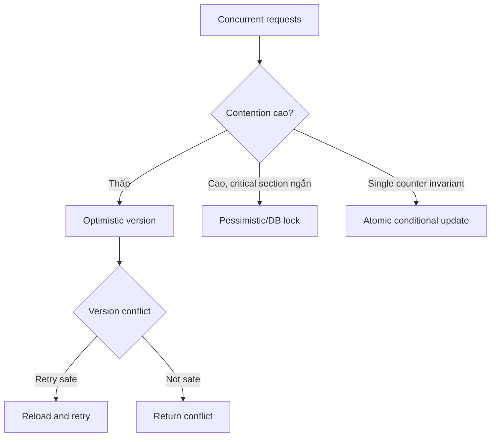

# Chọn concurrency control

## Mục tiêu học tập

Chọn optimistic locking, pessimistic lock hoặc atomic update dựa trên contention và hậu quả oversell.

## Bối cảnh

**Coupon redemption** là tình huống tổng hợp dùng để luyện quyết định. Hãy bắt đầu từ invariant, ownership và failure thay vì chọn pattern theo tên.

## Mô hình phân tích

## Dữ kiện cần làm rõ

- Tỷ lệ collision dự kiến và chi phí retry là bao nhiêu?
- Operation có external side effect trước commit không?
- Database hỗ trợ conditional update hoặc lock timeout nào?

## Bài tập tương tác

1. Mô phỏng 100 request redeem cùng coupon.
2. So sánh optimistic version với atomic update.
3. Xác định conflict response và retry budget.

## Câu hỏi review

- Conflict rate thực tế là bao nhiêu?
- Retry có lặp external side effect không?
- Lock timeout và deadlock được quan sát thế nào?

## Gợi ý lời giải

Chọn cơ chế nhỏ nhất bảo vệ invariant; đo contention thay vì đoán.

## Deliverable

- Decision matrix.
- Concurrent test scenario.
- Metric conflict/deadlock/latency.

## Tiêu chí hoàn thành

- Không oversell coupon.
- Retry không lặp charge/email.
- Lock hoặc version failure có error contract rõ.

## Enterprise drill

### Tình huống thực tế

Hai nhân viên cùng cập nhật tồn kho khả dụng; một tiến trình giữ dữ liệu cũ trong 500 ms trước khi ghi.

### Ma trận quyết định

| Thành phần | Lựa chọn | Lý do kiểm chứng |
|---|---|---|
| Optimistic locking | Xung đột hiếm | Version + retry có giới hạn |
| Pessimistic lock | Critical section ngắn | Theo dõi lock wait/deadlock |
| Single writer | Throughput theo partition | Cần partition key ổn định |

### Failure rehearsal

Chạy hai lệnh reserve cùng version. Chỉ một lệnh được commit; lệnh còn lại nhận conflict có thể xử lý.

### Hướng lời giải tham khảo

Chọn cơ chế theo tần suất xung đột, chi phí retry và latency budget. Luôn ghi rõ owner của retry, giới hạn attempt và metric conflict.

### Evidence cần bàn giao

- Load test ghi conflict rate, retry count và p95 latency.
- Test stale version trả conflict có nghĩa.
- Lock scope hoặc partition key được ghi trong diagram.
- Decision note nêu ngưỡng chuyển sang cơ chế khác.
