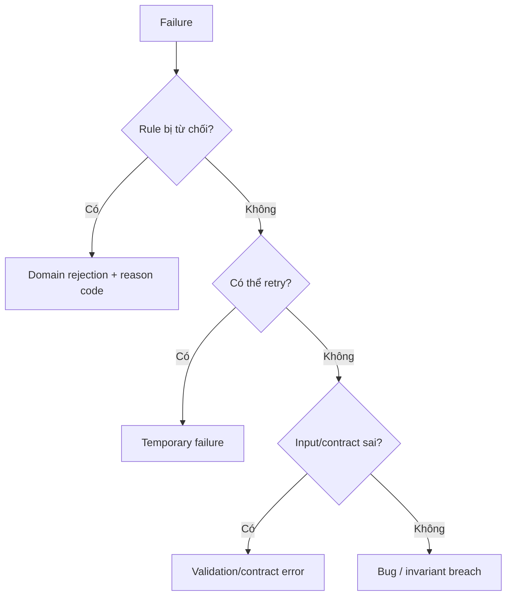

# Mô hình hóa domain errors

## Mục tiêu học tập

Phân biệt business rejection, validation error, temporary infrastructure failure và programming defect.

## Bối cảnh

**Loan approval** là tình huống tổng hợp dùng để luyện quyết định. Hãy bắt đầu từ invariant, ownership và failure thay vì chọn pattern theo tên.

## Mô hình phân tích

## Dữ kiện cần làm rõ

- Failure nào là business outcome hợp lệ?
- Caller nào có quyền retry hoặc sửa input?
- Thông tin nào được log nhưng không trả cho client?

## Bài tập tương tác

1. Tạo taxonomy cho năm failure của loan approval.
2. Map domain error sang HTTP/queue response.
3. Viết test cho reason code và redaction.

## Câu hỏi review

- Caller cần quyết định retry, sửa input hay dừng?
- Error code có ổn định hơn message không?
- Thông tin nhạy cảm có bị rò qua exception không?

## Gợi ý lời giải

Giữ error code ổn định; message dành cho người dùng có thể thay đổi hoặc dịch.

## Deliverable

- Error taxonomy.
- Mapping table theo boundary.
- Retry/alert policy.

## Tiêu chí hoàn thành

- Không dùng một exception cho mọi failure.
- Domain rejection không bị báo 500.
- Bug/invariant breach được alert riêng.

## Enterprise drill

### Tình huống thực tế

Checkout đang ném RuntimeException cho hết hàng, coupon hết hạn và provider timeout khiến caller không biết lỗi nào có thể retry.

### Ma trận quyết định

| Thành phần | Lựa chọn | Lý do kiểm chứng |
|---|---|---|
| OutOfStock | Business rejection | Không retry tự động |
| CouponExpired | Business rejection | Yêu cầu người dùng sửa |
| ProviderTimeout | Technical/ambiguous | Reconcile trước khi retry |

### Failure rehearsal

Mô phỏng timeout sau khi provider đã charge thành công. Không được trả lời đơn giản là “thất bại”; phải chuyển sang trạng thái pending reconciliation.

### Hướng lời giải tham khảo

Mô hình lỗi theo ý nghĩa và recovery, không theo lớp exception kỹ thuật. Domain error ổn định được map sang transport ở boundary; ambiguous outcome mang correlation id để điều tra.

### Evidence cần bàn giao

- Error catalog phân biệt rejection, transient và ambiguous outcome.
- Test timeout-after-success đưa operation vào reconciliation.
- Transport mapping giữ domain code ổn định.
- Log field chứa operation id và recovery action.
