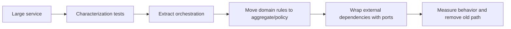

# Refactor Large Service

## Mục tiêu học tập

Tách orchestration, domain policy và adapter mà vẫn giữ behavior bằng characterization tests.

## Bối cảnh

**OrderApplicationService** là tình huống tổng hợp dùng để luyện quyết định. Hãy bắt đầu từ invariant, ownership và failure thay vì chọn pattern theo tên.

## Mô hình phân tích

## Dữ kiện cần làm rõ

- Method nào vừa query DB, quyết định policy và gọi API?
- Rule nào có vocabulary domain rõ?
- Dependency nào cần seam để characterization test?

## Bài tập tương tác

1. Vẽ responsibility map của service hiện tại.
2. Tách một use case bằng branch-by-abstraction.
3. So sánh behavior cũ/mới trên cùng fixture.

## Câu hỏi review

- Method nào đang trộn policy với I/O?
- Seam nhỏ nhất để thay từng phần là gì?
- Khi nào không nên tách thêm class?

## Gợi ý lời giải

Tạo safety net trước; tách theo reason-to-change chứ không theo số dòng.

## Deliverable

- Before/after dependency graph.
- Characterization tests.
- Migration và cleanup checklist.

## Tiêu chí hoàn thành

- Không tạo lớp chỉ forward.
- Rule domain không phụ thuộc framework.
- Có cách rollback về old path.

## Enterprise drill

### Tình huống thực tế

OrderService 1.200 dòng vừa validate, tính giá, giữ tồn kho, gọi payment, ghi audit và gửi notification.

### Ma trận quyết định

| Thành phần | Lựa chọn | Lý do kiểm chứng |
|---|---|---|
| Domain policy | Tính giá/invariant | Tách object thuần |
| Application orchestration | Transaction và ports | Giữ use case |
| Infrastructure | SDK/SQL/queue | Đặt sau interface |

### Failure rehearsal

Cắt payment adapter ra nhưng vẫn phải bảo toàn behavior khi timeout và rollback reservation.

### Hướng lời giải tham khảo

Tạo characterization tests trước, tìm seams theo reason-to-change, tách policy trước side effect. Không biến một God Service thành nhiều service forwarding không semantics.

### Evidence cần bàn giao

- Characterization tests khóa behavior cũ trước khi tách.
- Dependency diagram trước/sau cho thấy direction mới.
- Failure test chứng minh reservation được compensate khi payment lỗi.
- Cleanup checklist loại bỏ forwarding service thừa.
