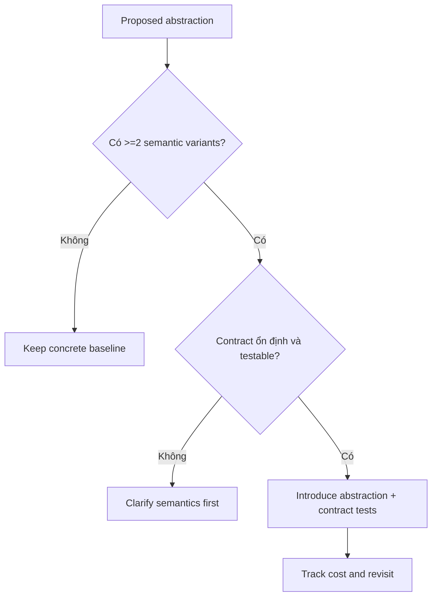

# Review một abstraction

## Mục tiêu học tập

Đánh giá abstraction có che volatility thật hay chỉ thêm forwarding layer.

## Bối cảnh

**Generic repository proposal** là tình huống tổng hợp dùng để luyện quyết định. Hãy bắt đầu từ invariant, ownership và failure thay vì chọn pattern theo tên.

## Mô hình phân tích

## Dữ kiện cần làm rõ

- Có bao nhiêu variation thật và semantics khác nhau ở đâu?
- Caller biết ít đi điều gì sau abstraction?
- Ai sở hữu contract và contract test?

## Bài tập tương tác

1. Chấm generic repository theo cost/benefit.
2. Viết baseline không abstraction.
3. Đặt revisit trigger sau ba tháng.

## Câu hỏi review

- Abstraction loại bỏ dependency nào?
- Contract có semantics hay chỉ CRUD forwarding?
- Evidence nào cho thấy extension point sẽ được dùng?

## Gợi ý lời giải

Abstraction tốt che volatility; abstraction xấu chỉ che tên concrete class.

## Deliverable

- Alternative table.
- Contract semantics.
- Decision/revisit note.

## Tiêu chí hoàn thành

- Có evidence variation.
- Không làm mất capability cần thiết.
- Chi phí wiring/debug được ghi rõ.

## Enterprise drill

### Tình huống thực tế

Đề xuất GenericRepository<T> cho toàn bộ entity nhưng reporting cần projection/cursor còn aggregate cần version và invariant.

### Ma trận quyết định

| Thành phần | Lựa chọn | Lý do kiểm chứng |
|---|---|---|
| Variation thật | Có semantics khác nhau | Có thể cần contract |
| Chỉ đổi tên class | Không giảm knowledge | Giữ concrete |
| Read/write khác mục tiêu | Tách Query Object và Repository | Tránh generic CRUD |

### Failure rehearsal

Thử thêm optimistic version và cursor pagination vào cùng generic contract; nếu interface phình to, abstraction đã sai boundary.

### Hướng lời giải tham khảo

Đánh giá abstraction bằng knowledge removed, semantics preserved và evidence variation. Đặt revisit trigger; sẵn sàng xóa abstraction nếu không còn giá trị.

### Evidence cần bàn giao

- Alternative table so sánh concrete baseline với abstraction.
- Contract test chỉ xuất hiện khi có semantic variants thật.
- Cost log ghi wiring, debugging và maintenance overhead.
- Revisit trigger có owner và ngày đánh giá.
