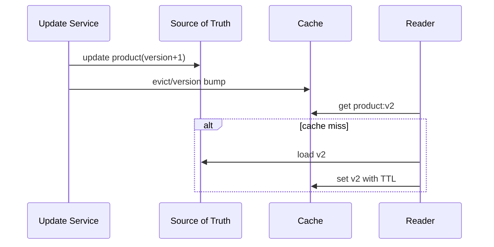

# Thiết kế cache invalidation

## Mục tiêu học tập

Chọn owner, freshness budget, key/version và invalidation strategy.

## Bối cảnh

**Product catalog** là tình huống tổng hợp dùng để luyện quyết định. Hãy bắt đầu từ invariant, ownership và failure thay vì chọn pattern theo tên.

## Mô hình phân tích

## Dữ kiện cần làm rõ

- Freshness SLO theo field/use case là gì?
- Key có chứa tenant/version/locale không?
- Update path nào có thể bỏ lỡ invalidation?

## Bài tập tương tác

1. Thiết kế cache-aside cho product detail.
2. Mô phỏng stampede và stale writer.
3. Chọn TTL, versioned key hoặc event invalidation.

## Câu hỏi review

- Freshness tối đa chấp nhận được là bao lâu?
- Ai chịu trách nhiệm invalidation?
- Cache stampede và stale write được chặn thế nào?

## Gợi ý lời giải

Source of truth luôn ở database; cache failure không được làm mất update.

## Deliverable

- Key strategy.
- Invalidation sequence.
- Freshness và hit-rate dashboard.

## Tiêu chí hoàn thành

- Không cross-tenant leak.
- Có stampede protection.
- Stale data nằm trong budget đã công bố.

## Enterprise drill

### Tình huống thực tế

Catalog cache theo product id nhưng giá còn phụ thuộc tenant, currency và promotion version.

### Ma trận quyết định

| Thành phần | Lựa chọn | Lý do kiểm chứng |
|---|---|---|
| Cache key | Đủ dimension | Tránh cross-tenant leak |
| Freshness | TTL/version | Phù hợp business tolerance |
| Invalidation | Event + fallback TTL | Có recovery khi mất event |

### Failure rehearsal

Thay promotion version nhưng không xóa cache cũ. Test phải chứng minh key/version ngăn trả giá sai.

### Hướng lời giải tham khảo

Bắt đầu từ source of truth và freshness contract. Cache key phải mã hóa mọi dimension ảnh hưởng kết quả; invalidation cần metric hit/stale và đường bypass khi sự cố.

### Evidence cần bàn giao

- Cache key specification liệt kê tenant, currency và promotion version.
- Stale-read test mô phỏng mất invalidation event.
- Metric cache age và bypass count xuất hiện trên dashboard.
- Runbook mô tả cách disable cache an toàn.
