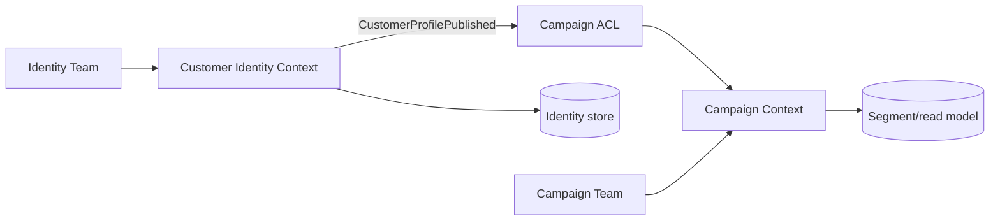

# Tách Bounded Context

## Mục tiêu học tập

Tách model khi ngôn ngữ, ownership và nhịp thay đổi đã khác nhau.

## Bối cảnh

**CRM identity và campaign** là tình huống tổng hợp dùng để luyện quyết định. Hãy bắt đầu từ invariant, ownership và failure thay vì chọn pattern theo tên.

## Mô hình phân tích

## Dữ kiện cần làm rõ

- Term Customer có nghĩa khác nhau ở Identity và Campaign không?
- Team nào sở hữu schema và release cadence?
- Integration cần ACL hay shared kernel?

## Bài tập tương tác

1. Lập context map hiện tại.
2. Định nghĩa published language tối thiểu.
3. Lập migration từ shared table sang projection.

## Câu hỏi review

- Hai context có dùng cùng từ với nghĩa khác không?
- Ai là upstream và compatibility policy là gì?
- Có thể tách module trước khi tách service không?

## Gợi ý lời giải

Tách module và contract trước; chỉ tách deployment khi có evidence ownership/scale.

## Deliverable

- Context map.
- Contract/event schema.
- Ownership và migration plan.

## Tiêu chí hoàn thành

- Không dùng chung entity mutable.
- Upstream/downstream rõ.
- Consumer migration có compatibility window.

## Enterprise drill

### Tình huống thực tế

CRM vừa quản lý identity, consent, campaign và billing preference; cùng thuật ngữ “customer” có nghĩa khác nhau giữa đội.

### Ma trận quyết định

| Thành phần | Lựa chọn | Lý do kiểm chứng |
|---|---|---|
| Language | Định nghĩa khác nhau | Tín hiệu split |
| Transaction | Không cần atomic xuyên capability | Tách boundary |
| Integration | Event/ACL | Version contract |

### Failure rehearsal

Thay consent model mà không làm hỏng campaign history. Thiết kế cần Anti-Corruption Layer hoặc event versioning.

### Hướng lời giải tham khảo

Tách theo language, ownership và change cadence. Vẽ context map, chọn upstream/downstream, định nghĩa integration event và migration thay vì chia theo bảng dữ liệu.

### Evidence cần bàn giao

- Context map thể hiện upstream/downstream và ACL.
- Glossary chỉ ra thuật ngữ customer khác nghĩa.
- Compatibility test bảo vệ event version trong migration.
- Ownership matrix xác định đội chịu trách nhiệm từng context.
