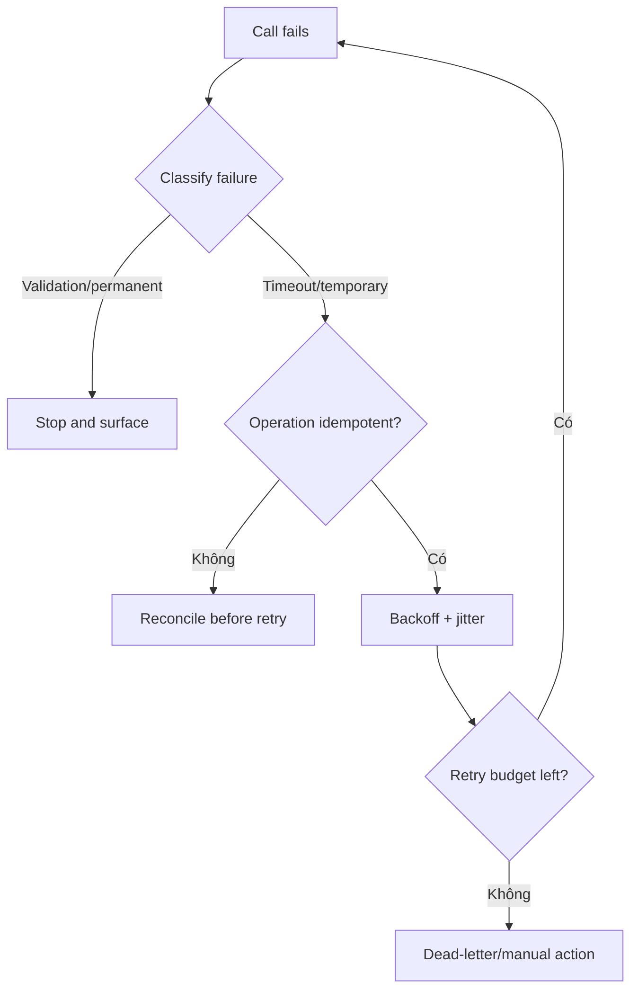

# Chọn retry policy

## Mục tiêu học tập

Thiết kế timeout, retry budget, backoff, jitter và idempotency theo loại lỗi.

## Bối cảnh

**External payment call** là tình huống tổng hợp dùng để luyện quyết định. Hãy bắt đầu từ invariant, ownership và failure thay vì chọn pattern theo tên.

## Mô hình phân tích

## Dữ kiện cần làm rõ

- Operation có idempotency key hoặc reconciliation API không?
- Provider trả error nào là permanent?
- End-to-end deadline còn bao nhiêu sau mỗi attempt?

## Bài tập tương tác

1. Tạo retry matrix theo error code.
2. Tính retry budget cho latency SLO 2 giây.
3. Mô phỏng timeout sau provider success.

## Câu hỏi review

- HTTP status nào thực sự retryable?
- Timeout sau provider success được reconcile ra sao?
- Retry budget có nằm trong latency SLO không?

## Gợi ý lời giải

Timeout không chứng minh operation thất bại; reconcile trước retry nếu side effect có thể đã xảy ra.

## Deliverable

- Retry classification table.
- Backoff/jitter formula.
- Manual recovery path.

## Tiêu chí hoàn thành

- Không retry validation lỗi.
- Có max attempts/dead-letter.
- Retry storm được giới hạn.

## Enterprise drill

### Tình huống thực tế

Notification provider trả timeout, 429, 400 và đôi khi timeout sau khi đã nhận request.

### Ma trận quyết định

| Thành phần | Lựa chọn | Lý do kiểm chứng |
|---|---|---|
| 429/503 | Transient | Backoff + jitter |
| 400 validation | Permanent | Không retry |
| Timeout sau send | Ambiguous | Lookup/reconcile bằng idempotency key |

### Failure rehearsal

Mô phỏng timeout sau provider accepted. Retry mù có thể gửi trùng; policy phải chuyển sang reconciliation.

### Hướng lời giải tham khảo

Retry chỉ đúng khi operation idempotent hoặc có idempotency key. Phân loại failure, đặt budget/deadline, ghi attempt metric và dead-letter path.

### Evidence cần bàn giao

- Failure classification table nêu retryable và ambiguous cases.
- Test backoff/jitter không retry validation error.
- Idempotency/reconciliation contract được chứng minh bằng test.
- Metric retry budget và dead-letter age có alert.
