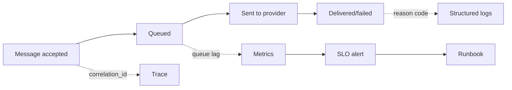

# Thiết kế observability

## Mục tiêu học tập

Thiết kế telemetry từ business outcome thay vì chỉ CPU/log kỹ thuật.

## Bối cảnh

**Notification delivery** là tình huống tổng hợp dùng để luyện quyết định. Hãy bắt đầu từ invariant, ownership và failure thay vì chọn pattern theo tên.

## Mô hình phân tích

## Dữ kiện cần làm rõ

- Business outcome nào định nghĩa delivered?
- Message ID có đi qua provider callback không?
- Alert nào thực sự yêu cầu hành động trong 15 phút?

## Bài tập tương tác

1. Định nghĩa RED metrics cho notification.
2. Thiết kế trace qua queue và provider.
3. Viết SLO và burn-rate alert.

## Câu hỏi review

- Metric nào phản ánh outcome người dùng?
- Correlation key đi qua queue/provider thế nào?
- Alert có owner và runbook hành động được không?

## Gợi ý lời giải

Bắt đầu từ accepted/sent/delivered/failed, sau đó mới chọn log/metric/trace.

## Deliverable

- Telemetry schema.
- SLO dashboard.
- Alert-to-runbook mapping.

## Tiêu chí hoàn thành

- Log có correlation và reason code.
- Metric phân biệt provider/consumer lỗi.
- Alert tránh noise và có owner.

## Enterprise drill

### Tình huống thực tế

Notification được queue thành công nhưng người dùng không nhận được; log chỉ có “job completed”.

### Ma trận quyết định

| Thành phần | Lựa chọn | Lý do kiểm chứng |
|---|---|---|
| Business state | accepted/sent/delivered | Theo dõi outcome |
| Technical state | queue lag/provider latency | Tìm bottleneck |
| Correlation | message id/tenant/provider | Điều tra xuyên boundary |

### Failure rehearsal

Provider trả success nhưng delivery receipt không đến. Dashboard phải cho thấy pending-delivery và alert theo SLO, không chỉ HTTP 200.

### Hướng lời giải tham khảo

Thiết kế telemetry từ câu hỏi vận hành: điều gì đã xảy ra, ở đâu, với ai và có phục hồi không. Metric, structured log, trace và runbook phải liên kết cùng correlation id.

### Evidence cần bàn giao

- Telemetry map nối business state với metric/log/trace.
- Correlation id xuyên queue và provider callback.
- SLO dùng delivered outcome thay vì job success.
- Alert có runbook và verification query tương ứng.
