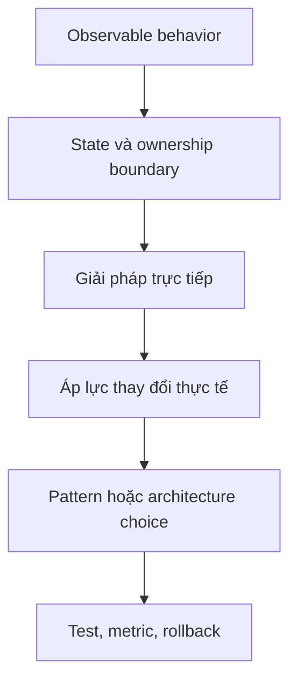

# Interactive Learning

Các bài trong thư mục này dùng decision tree, Mermaid diagram và design challenge để luyện cách chọn giải pháp dựa trên context, invariant và failure mode.

## Nội dung

- [Quy chuẩn sơ đồ](diagram-guidelines.md)
- [Chọn đồng bộ hay bất đồng bộ](13-choose-sync-vs-async.md)
- [Thiết kế webhook có khả năng phục hồi](14-design-a-resilient-webhook.md)
- [Tìm aggregate boundary](15-find-the-aggregate-boundary.md)
- [Debug eventual consistency](16-debug-eventual-consistency.md)
- [Chọn cơ chế kiểm soát đồng thời](17-select-concurrency-control.md)
- [Mô hình hóa domain error](18-model-domain-errors.md)
- [Refactor large service](19-refactor-large-service.md)
- [Review một abstraction](20-review-an-abstraction.md)
- [Thiết kế cache invalidation](21-design-cache-invalidation.md)
- [Tách bounded context](22-split-a-bounded-context.md)
- [Chọn retry policy](23-choose-retry-policy.md)
- [Thiết kế observability](24-design-observability.md)

Mỗi bài nên được thực hiện theo thứ tự: xác định context → ghi invariant → liệt kê failure mode → chọn phương án → nêu trade-off → xác định test và metric.

## Cách sử dụng các bài tương tác

Mỗi bài nên được giải theo ba lượt: dự đoán trước khi xem đáp án, vẽ lại flow bằng ngôn ngữ của bạn, rồi thay một constraint để xem quyết định có còn đúng. Không chấm điểm dựa trên tên pattern; hãy chấm theo invariant, failure path và khả năng giải thích trade-off.

## Definition of Done

Một bài được xem là hoàn thành khi người học có thể trình bày: bối cảnh, lực thay đổi, lựa chọn, phương án bị loại, rủi ro vận hành và test dùng để chứng minh quyết định.

## Protocol học tương tác

Mỗi bài interactive nên được thực hiện theo bốn lượt, không đọc lời giải ngay:

1. **Mô tả observable behavior:** đầu vào, output, side effect và failure mà người dùng nhìn thấy.
2. **Vẽ boundary:** ai sở hữu state, ai chỉ orchestration, dependency nào nằm ngoài trust boundary.
3. **Chọn baseline:** thử giải pháp trực tiếp ít abstraction nhất trước khi đề xuất pattern.
4. **Kiểm chứng:** viết test/failure scenario và metric có thể bác bỏ lựa chọn.

## Ma trận kỹ năng

| Nhóm bài | Kỹ năng chính | Artifact cần tạo |
|---|---|---|
| Consistency | transaction, version, idempotency | state diagram + conflict test |
| Integration | adapter, error mapping, retry | port contract + contract test |
| Architecture | boundary, context, dependency | context map + ADR |
| Operations | observability, retry, cache | SLO + runbook + failure drill |
