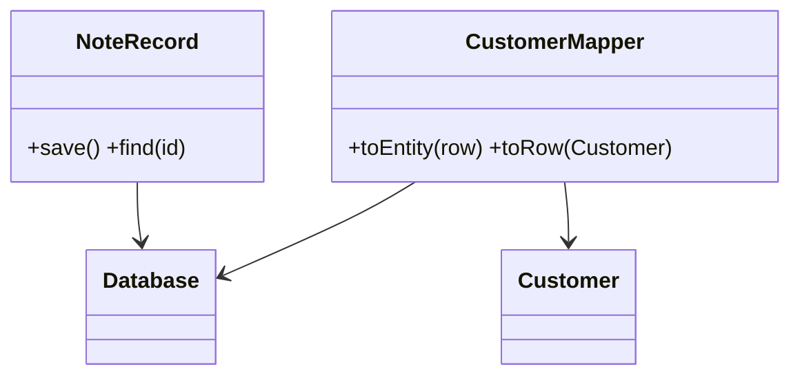
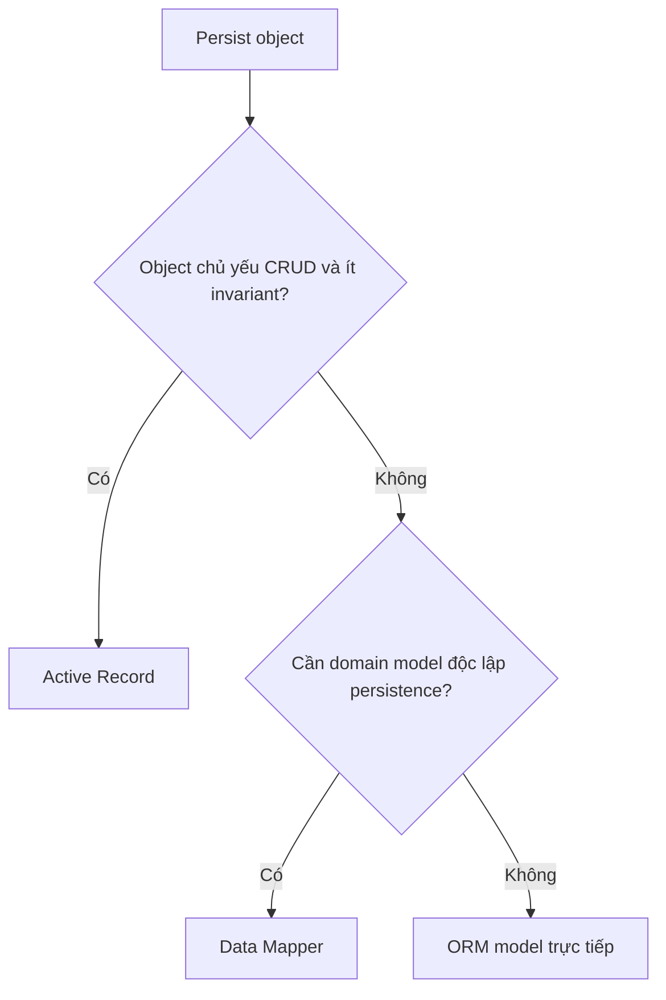

# Active Record và Data Mapper

## Khác biệt cốt lõi

Active Record đặt persistence API trên entity/record; Data Mapper giữ domain object độc lập và giao mapping cho một component bên ngoài.

| Tiêu chí | Pattern thứ nhất | Pattern thứ hai |
|---|---|---|
| Persistence knowledge | Nằm trong record | Nằm trong mapper/repository |
| Phù hợp | CRUD đơn giản | Domain model giàu invariant |
| Test | Có thể cần DB/fake static seam | Domain test độc lập persistence |
| Chi phí | Đơn giản nhưng coupling cao | Nhiều mapping/wiring hơn |

## Mô hình cộng tác

## Cây quyết định

## Bài tập phân tích

So sánh NoteRecord tự save với Customer domain object qua mapper. Viết test domain rule của Customer không cần database và ghi chi phí mapping schema evolution.

## Cách kiểm chứng lựa chọn

1. Viết domain rule test không database cho Data Mapper model.
2. Test round-trip entity ↔ row, gồm nullability và value object.
3. Với Active Record, đo số test cần database và lifecycle coupling.
4. Mô phỏng schema evolution để so sánh nơi phải sửa.

## Câu hỏi review

- Domain object có cần tồn tại độc lập persistence không?
- Mapping lỗi hoặc schema mismatch được phát hiện ở đâu?
- Active Record callback có tạo side effect ẩn không?
- Chi phí mapper có đáng với độ phức tạp domain hiện tại không?

## Dấu hiệu chọn sai

Active Record hợp lý với CRUD nhỏ, lifecycle ngắn và schema gần domain. Khi aggregate có invariant phức tạp, nhiều nguồn dữ liệu hoặc cần test độc lập persistence, Data Mapper tách domain tốt hơn. Failure thường gặp là Active Record gọi query trong domain loop hoặc Data Mapper biến thành lớp copy field máy móc. Integration test phải xác nhận mapping và transaction semantics.
