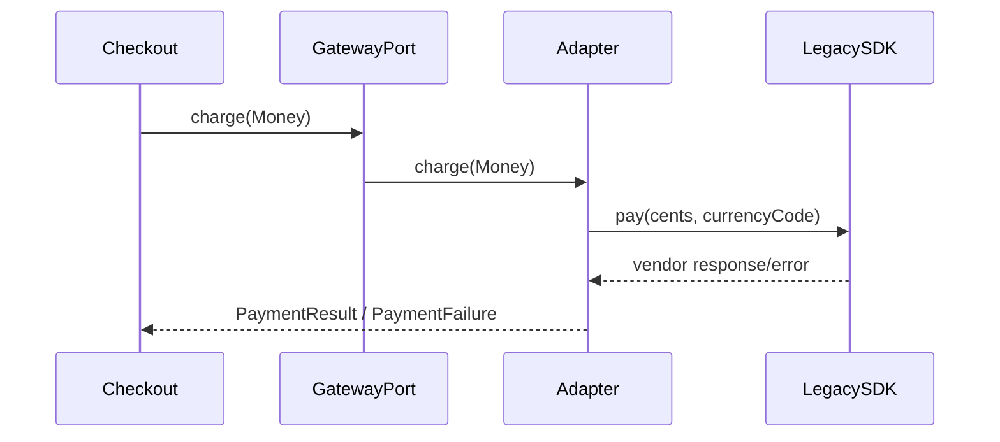
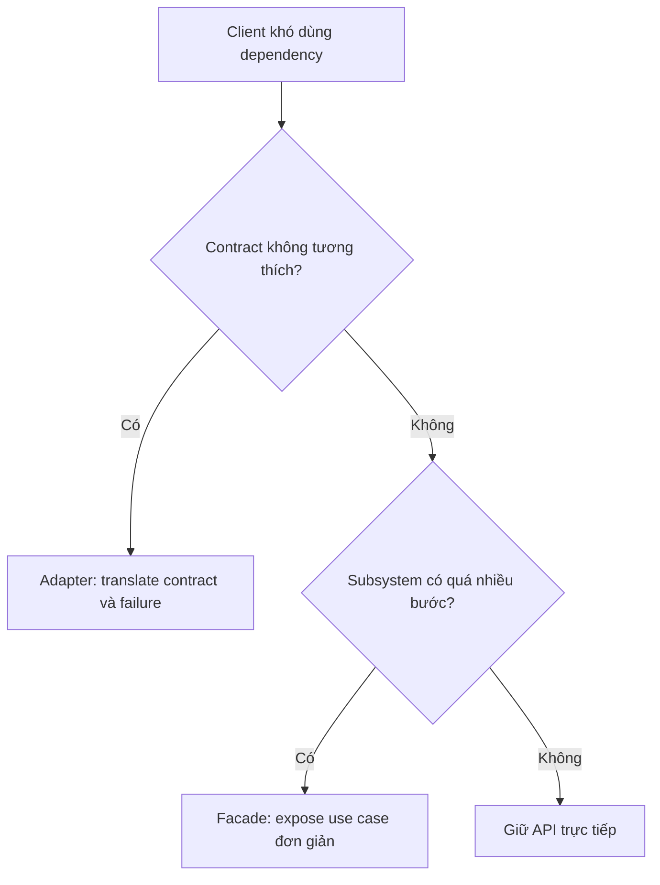
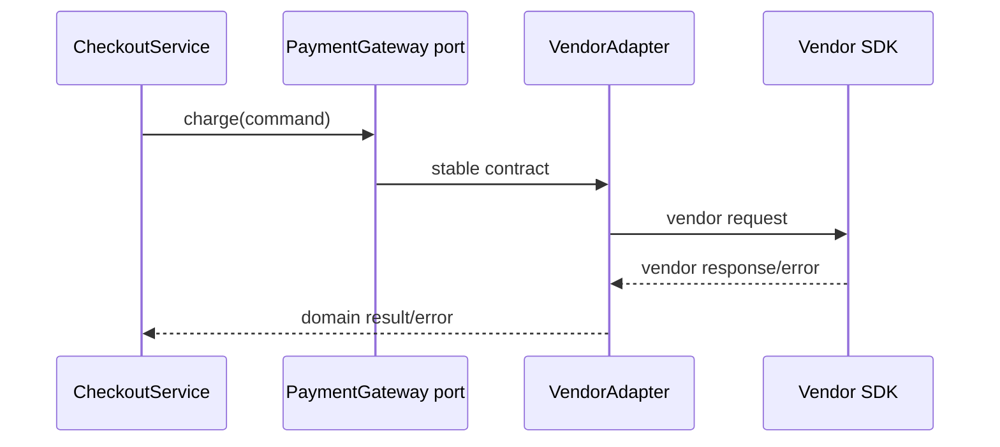

# Adapter và Facade

## Khác biệt cốt lõi

Adapter dịch một contract không tương thích sang contract ứng dụng cần; Facade gom một subsystem phức tạp thành use-case API đơn giản hơn.

| Tiêu chí | Pattern thứ nhất | Pattern thứ hai |
|---|---|---|
| Mục tiêu | Tương thích contract | Giảm độ phức tạp sử dụng |
| Có thay semantics? | Có mapping request/result/error | Thường giữ semantics subsystem |
| Đối tượng bọc | Một provider/legacy API | Nhiều subsystem phối hợp |
| Test trọng tâm | Contract test và error translation | Integration test workflow |

## Mô hình cộng tác

## Cây quyết định

## Bài tập phân tích

Bọc SDK thanh toán cũ bằng Adapter và tạo VideoConversionFacade điều phối decoder, encoder và storage. Nêu rõ Adapter phải dịch lỗi nào, Facade phải giữ nguyên lỗi nào.

## Cách kiểm chứng lựa chọn

1. Viết contract test chạy cho adapter fake và adapter vendor thật.
2. Mô phỏng timeout/vendor error và kiểm tra mapping sang application failure ổn định.
3. Với Facade, test workflow phối hợp subsystem và rollback/cleanup khi bước giữa lỗi.
4. Xác nhận Facade không dịch semantics mà chỉ đơn giản hóa orchestration.

## Câu hỏi review

- Contract nào thực sự không tương thích?
- Adapter có làm mất thông tin lỗi cần cho reconciliation không?
- Facade đang che complexity hay che luôn failure quan trọng?
- Client có còn import vendor type sau refactor không?

## Tình huống production để phân biệt

Adapter bảo vệ application khỏi contract vendor: đổi request, response và exception của cổng thanh toán thành `PaymentGateway`. Facade chỉ gom nhiều subsystem nội bộ như transcoder, storage và metadata thành một use case đơn giản hơn; nó không nhất thiết dịch contract không tương thích.

Contract test là evidence chính của Adapter; integration test theo workflow là evidence chính của Facade.
