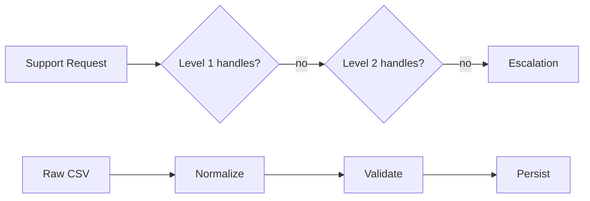
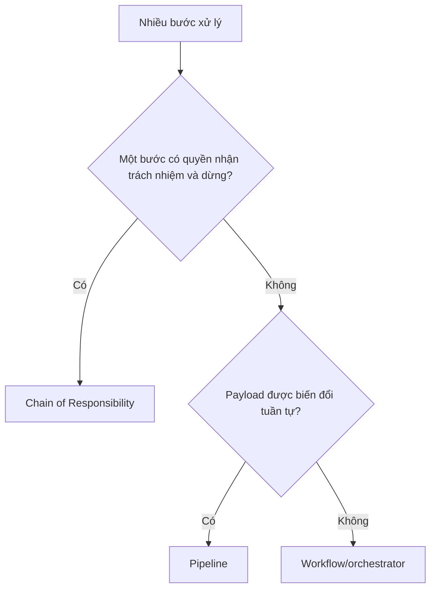

# Chain of Responsibility và Pipeline

## Khác biệt cốt lõi

Chain chuyển request qua handler cho đến khi một handler xử lý hoặc dừng; Pipeline biến đổi payload qua chuỗi stage đã biết và thường chạy theo thứ tự.

| Tiêu chí | Pattern thứ nhất | Pattern thứ hai |
|---|---|---|
| Termination | Handler có thể xử lý và dừng | Stage thường truyền output sang stage sau |
| Topology | Handler biết next | Pipeline/runner sở hữu danh sách stage |
| Use case | Authorization, support escalation | Import, middleware, normalization |
| Test | Handled/unhandled/ordering | Stage contract và transformed payload |

## Mô hình cộng tác

## Cây quyết định

## Bài tập phân tích

Dùng Chain cho support escalation và Pipeline cho CSV import. Viết test request không ai xử lý và test stage validation chặn persist.

## Cách kiểm chứng lựa chọn

1. Test request được xử lý bởi handler đầu, giữa và không handler nào.
2. Kiểm tra Chain không gọi các handler sau khi đã handled.
3. Với Pipeline, test payload sau từng stage và ordering contract.
4. Mô phỏng stage lỗi để xác định rollback/partial output.

## Câu hỏi review

- Một bước có quyền kết thúc xử lý hay mọi stage đều phải chạy?
- Ai sở hữu danh sách/order của handler hoặc stage?
- Unhandled request được biểu diễn ra sao?
- Stage có mutable shared state làm pipeline khó retry không?

## Dấu hiệu chọn sai

Chain cho phép handler quyết định dừng hoặc chuyển request; Pipeline thường chạy qua các stage theo thứ tự xác định và biến đổi context. Nếu mọi handler đều phải chạy, gọi đó là Chain dễ gây hiểu nhầm. Nếu stage có thể claim request và short-circuit theo ownership, Pipeline thuần túy không đủ diễn đạt. Test cần khóa ordering, stop condition và error propagation.
