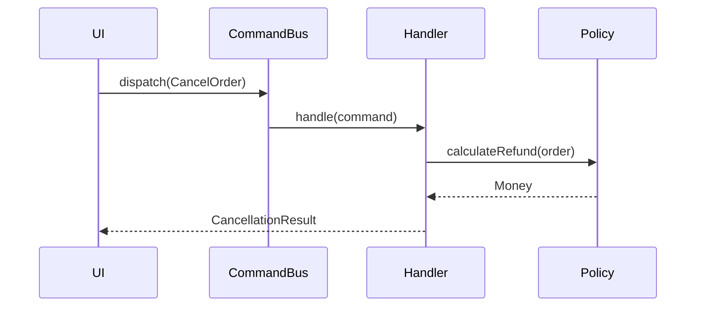
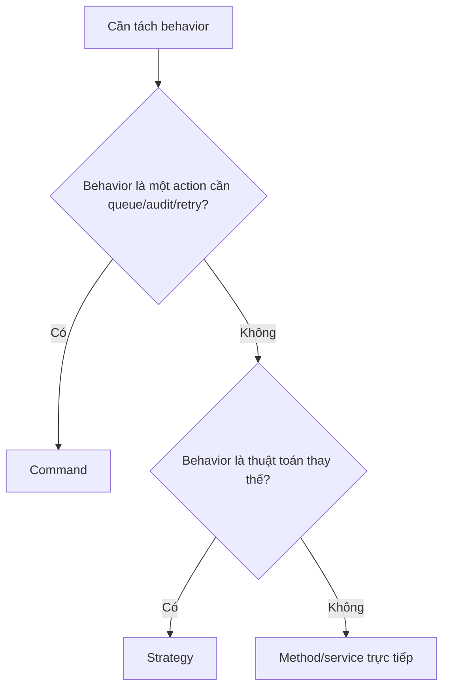

# Command và Strategy

## Khác biệt cốt lõi

Command đóng gói một hành động có thể queue, retry, audit hoặc undo; Strategy đóng gói cách thực hiện một quyết định trong cùng use case.

| Tiêu chí | Pattern thứ nhất | Pattern thứ hai |
|---|---|---|
| Đại diện | Một yêu cầu/hành động | Một thuật toán/chính sách |
| Dữ liệu | Mang input của action | Nhận input từ context |
| Lifecycle | Có thể persist/queue/retry | Thường sống trong process |
| Test | Handler + idempotency | Contract giữa strategies |

## Mô hình cộng tác

## Cây quyết định

## Bài tập phân tích

Tạo CancelOrderCommand và RefundPolicy strategy. Test duplicate command không refund hai lần, đồng thời mọi refund policy phải tuân contract không trả số âm.

## Cách kiểm chứng lựa chọn

1. Serialize/deserialize command và xác nhận đủ dữ liệu để xử lý lại.
2. Dispatch duplicate command với cùng idempotency key.
3. Chạy cùng input qua mọi strategy và kiểm tra contract invariant.
4. So sánh command handler mỏng với service chứa cả policy để tránh trộn hai vai trò.

## Câu hỏi review

- Object đại diện cho hành động hay thuật toán?
- Command có identity, audit và retry semantics không?
- Strategy có phụ thuộc execution history không?
- Handler có đang chứa policy nên tách thành Strategy không?

## Dấu hiệu chọn sai

Command đóng gói một intent có thể queue, retry, audit hoặc undo; Strategy đóng gói cách thực hiện một policy. Nếu object cần identity, timestamp và lifecycle, nó gần Command hơn. Nếu object chỉ thay thuật toán và không có lịch sử riêng, Strategy rõ hơn. Test Command cần kiểm tra side effect và idempotency; test Strategy cần kiểm tra kết quả cùng contract.
