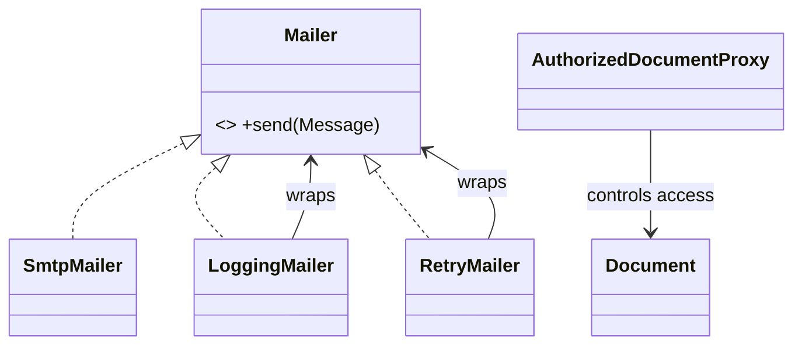
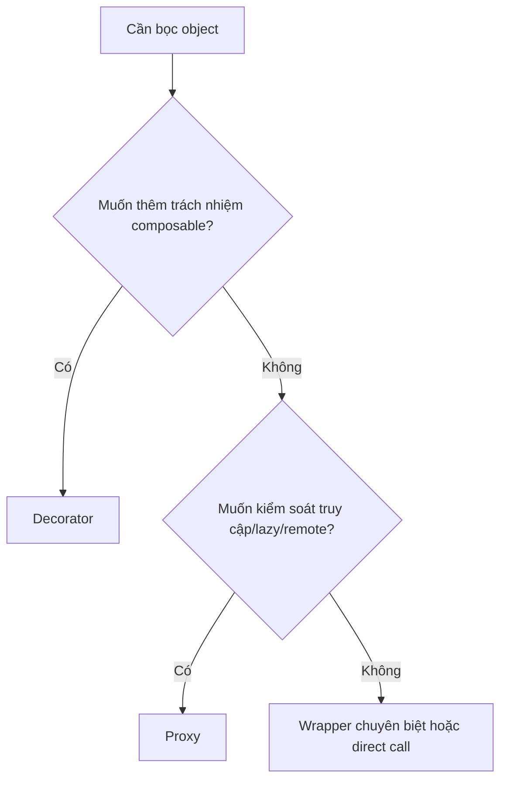
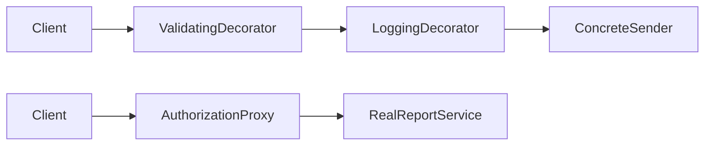

# Decorator và Proxy

## Khác biệt cốt lõi

Decorator ghép thêm trách nhiệm có thể xếp chồng; Proxy kiểm soát quyền truy cập, lifecycle hoặc vị trí của object được đại diện.

| Tiêu chí | Pattern thứ nhất | Pattern thứ hai |
|---|---|---|
| Ý định | Bổ sung behavior | Kiểm soát access |
| Số wrapper | Thường nhiều và composable | Thường một đại diện chính |
| Order | Có thể thay đổi semantics | Ít khi là feature công khai |
| Ví dụ | Retry + logging + metrics | Authorization, lazy load, remote proxy |

## Mô hình cộng tác

## Cây quyết định

## Bài tập phân tích

Thiết kế Mailer có LoggingDecorator và RetryDecorator; thiết kế DocumentProxy kiểm tra quyền. Viết test chứng minh thứ tự decorator ảnh hưởng log/retry nhưng proxy không thay nội dung document.

## Cách kiểm chứng lựa chọn

1. Test từng decorator độc lập và cả chain theo hai thứ tự khác nhau.
2. Mô phỏng retry sau timeout để xác nhận operation có idempotent hay không.
3. Test proxy từ chối unauthorized access trước khi gọi real subject.
4. So sánh overhead/lifecycle của wrapper với direct call.

## Câu hỏi review

- Wrapper thêm behavior hay kiểm soát access?
- Thứ tự decorator có thay đổi side effect không?
- Proxy có giữ nguyên contract và result semantics không?
- Logging/retry/cache nên là decorator, middleware hay infrastructure policy?

## Tình huống production để phân biệt

Decorator ghép thêm behavior như validation, logging hoặc compression và thường cho phép xếp chồng. Proxy giữ cùng contract nhưng kiểm soát quyền truy cập, lazy loading, remote call hoặc cache. Với Decorator, thứ tự wrapper là một phần behavior; với Proxy, câu hỏi chính là client có được phép hoặc có cần truy cập object thật hay không.

Test Decorator phải chứng minh delegation và ordering. Test Proxy phải chứng minh access policy, cache/lazy semantics hoặc remote error mapping.
