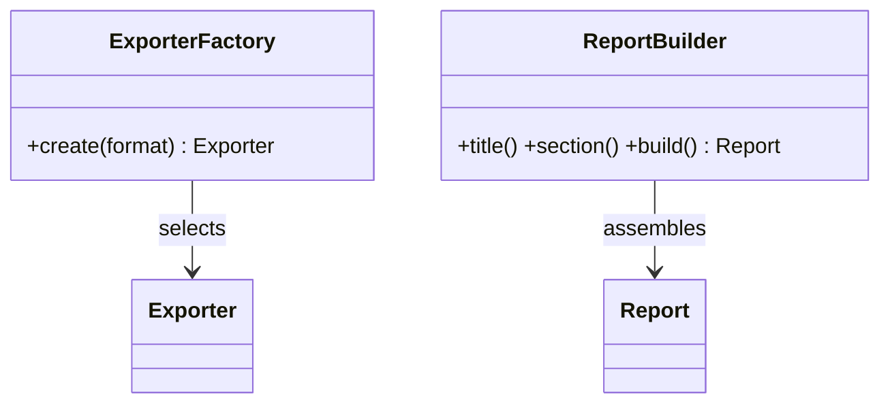
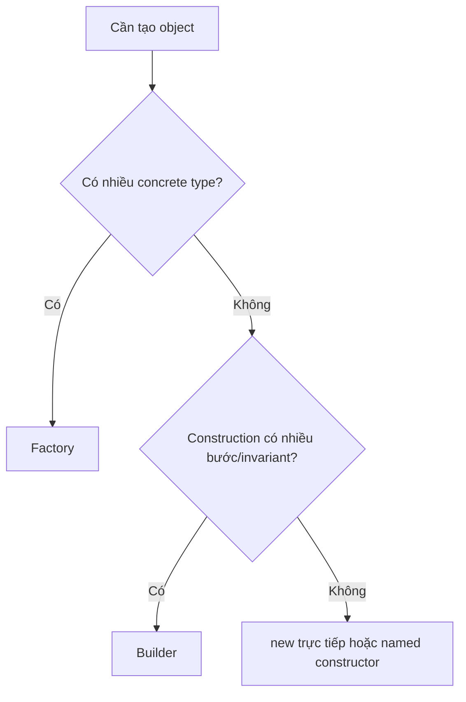
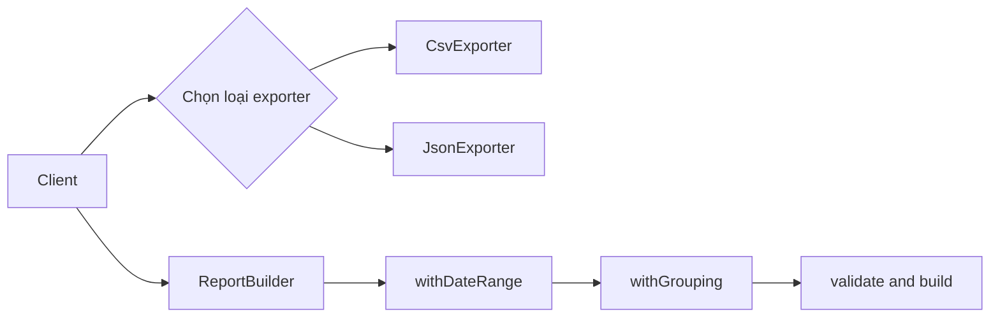

# Factory và Builder

## Khác biệt cốt lõi

Factory quyết định concrete product cần tạo; Builder điều phối nhiều bước để tạo một object phức tạp và kiểm tra object chỉ hợp lệ khi hoàn tất.

| Tiêu chí | Pattern thứ nhất | Pattern thứ hai |
|---|---|---|
| Câu hỏi chính | Tạo loại object nào? | Lắp object phức tạp như thế nào? |
| Input | Discriminator/configuration | Các bước và option tích lũy |
| Output | Một product hoàn chỉnh | Object hoàn chỉnh sau build() |
| Rủi ro | Factory thành switch khổng lồ | Builder tạo object bán thành phẩm |

## Mô hình cộng tác

## Cây quyết định

## Bài tập phân tích

Tạo ExporterFactory cho CSV/JSON và ReportBuilder cho báo cáo gồm header, section và footer. So sánh lỗi khi format không hỗ trợ với lỗi khi report thiếu section bắt buộc.

## Cách kiểm chứng lựa chọn

1. Thêm một exporter mới và đo số file phải sửa trong Factory.
2. Tạo report thiếu section bắt buộc và xác nhận Builder từ chối `build()`.
3. So sánh named constructor/direct `new` với Factory cho trường hợp chỉ có một product.
4. Kiểm tra Builder không expose object bán thành phẩm ra ngoài.

## Câu hỏi review

- Factory đang chọn type hay đang lắp từng phần của một object?
- Builder có enforce invariant tại `build()` không?
- Discriminator không hợp lệ được biểu diễn thế nào?
- Có thể thay Factory bằng map/DI container đơn giản hơn không?

## Tình huống production để phân biệt

Factory phù hợp khi client cần một object hợp lệ ngay sau một quyết định tạo, chẳng hạn chọn `CsvExporter` hay `JsonExporter`. Builder phù hợp khi object được hình thành qua nhiều bước, có field tùy chọn và cần validate invariant ở `build()`, chẳng hạn cấu hình báo cáo có filter, grouping, timezone và delivery target.

Không dùng Builder chỉ để thay constructor ba tham số; không dùng Factory để che một chuỗi mutation phức tạp mà không có bước validate cuối.
