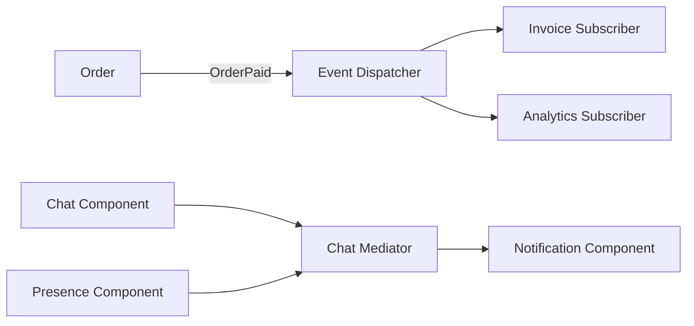
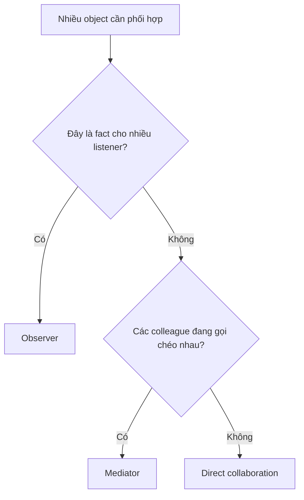

# Observer và Mediator

## Khác biệt cốt lõi

Observer phát một fact cho nhiều subscriber không biết nhau; Mediator điều phối tương tác hai chiều giữa các colleague để tránh coupling dạng mạng nhện.

| Tiêu chí | Pattern thứ nhất | Pattern thứ hai |
|---|---|---|
| Luồng | Publisher → nhiều subscribers | Colleague ↔ mediator ↔ colleague |
| Ý nghĩa message | Fact đã xảy ra | Yêu cầu phối hợp/interaction |
| Ownership workflow | Phân tán ở subscribers | Tập trung tại mediator |
| Rủi ro | Ordering, duplicate, hidden side effects | Mediator thành God Object |

## Mô hình cộng tác

## Cây quyết định

## Bài tập phân tích

Dùng Observer cho OrderPaid và Mediator cho các component trong màn hình chat. So sánh nơi đặt workflow, cách trace và failure isolation.

## Cách kiểm chứng lựa chọn

1. Gửi cùng event hai lần và xác nhận subscriber idempotent hoặc phát hiện duplicate.
2. Thay đổi thứ tự subscriber để xem workflow có phụ thuộc ngầm không.
3. Với Mediator, test một interaction giữa hai colleague mà không cho chúng tham chiếu trực tiếp.
4. Đo khả năng trace flow và kích thước mediator khi thêm interaction mới.

## Câu hỏi review

- Message là fact đã xảy ra hay yêu cầu phối hợp?
- Workflow owner nằm ở subscriber hay mediator?
- Failure của một subscriber ảnh hưởng publisher thế nào?
- Mediator có đang trở thành nơi chứa toàn bộ business logic không?

## Dấu hiệu chọn sai

Observer phù hợp khi publisher phát fact và không cần biết subscriber. Mediator phù hợp khi nhiều component cần phối hợp theo một protocol trung tâm. Nếu subscriber bắt đầu gọi chéo nhau hoặc phụ thuộc thứ tự ẩn, event model đã biến thành mediator không tên. Test Observer tập trung delivery/idempotency; test Mediator tập trung orchestration và state của workflow.
