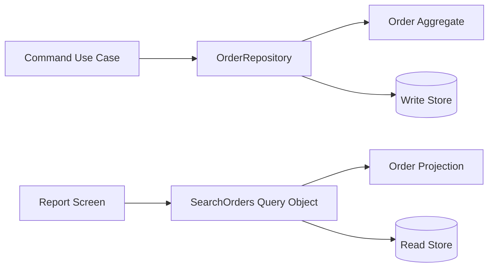
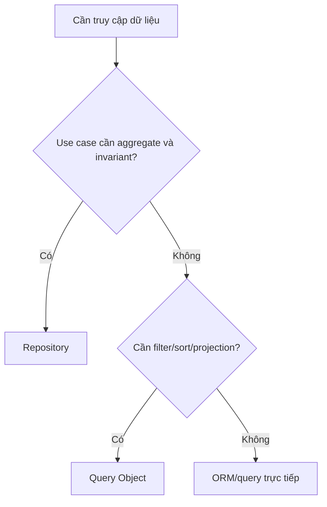
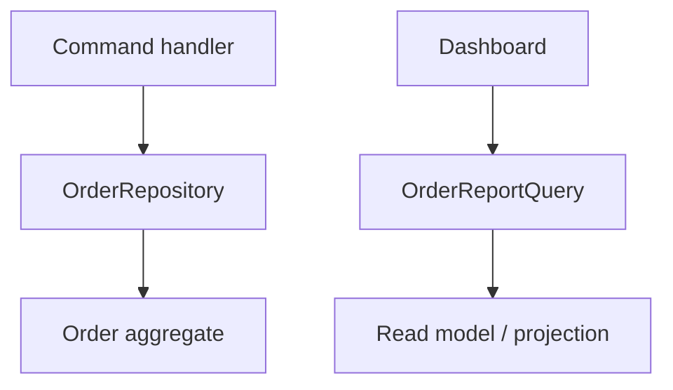

# Repository và Query Object

## Khác biệt cốt lõi

Repository mô hình hóa collection của aggregate cho write/use-case semantics; Query Object đóng gói truy vấn đọc, filter, sort, pagination và projection.

| Tiêu chí | Pattern thứ nhất | Pattern thứ hai |
|---|---|---|
| Đối tượng trả về | Aggregate/domain object | Read model/projection |
| Mục tiêu | Bảo vệ domain/persistence boundary | Tối ưu truy vấn và presentation needs |
| API | byId, add, save | search(criteria), paginate |
| Rủi ro | Generic CRUD wrapper | Query Object thành God query |

## Mô hình cộng tác

## Cây quyết định

## Bài tập phân tích

Tạo OrderRepository cho cancel order và SearchOrders Query Object cho backoffice. Chứng minh read model không bị ép thành aggregate và repository không trả query builder.

## Cách kiểm chứng lựa chọn

1. Chạy contract test repository cho in-memory và database implementation.
2. Test optimistic locking/not-found semantics khi lưu aggregate.
3. Với Query Object, test sort ổn định, cursor và projection fields.
4. Đo query plan/index thay vì ép read concern qua aggregate repository.

## Câu hỏi review

- Use case cần aggregate behavior hay chỉ cần dữ liệu hiển thị?
- Repository có trả Query Builder/ORM type không?
- Query Object có pagination và ordering deterministic không?
- Transaction owner của write path nằm ở đâu?

## Tình huống production để phân biệt

Repository mô phỏng collection của aggregate và phục vụ command side: load aggregate, giữ version, save theo transaction boundary. Query Object phục vụ read side: projection, filter, sort, cursor và shape dữ liệu tối ưu cho màn hình/báo cáo. Ép báo cáo nhiều join qua Repository thường làm contract domain bị méo.

Review bằng hai câu hỏi: operation có cần bảo vệ invariant của aggregate không, hay chỉ cần trả về dữ liệu đọc đúng shape và hiệu năng?
