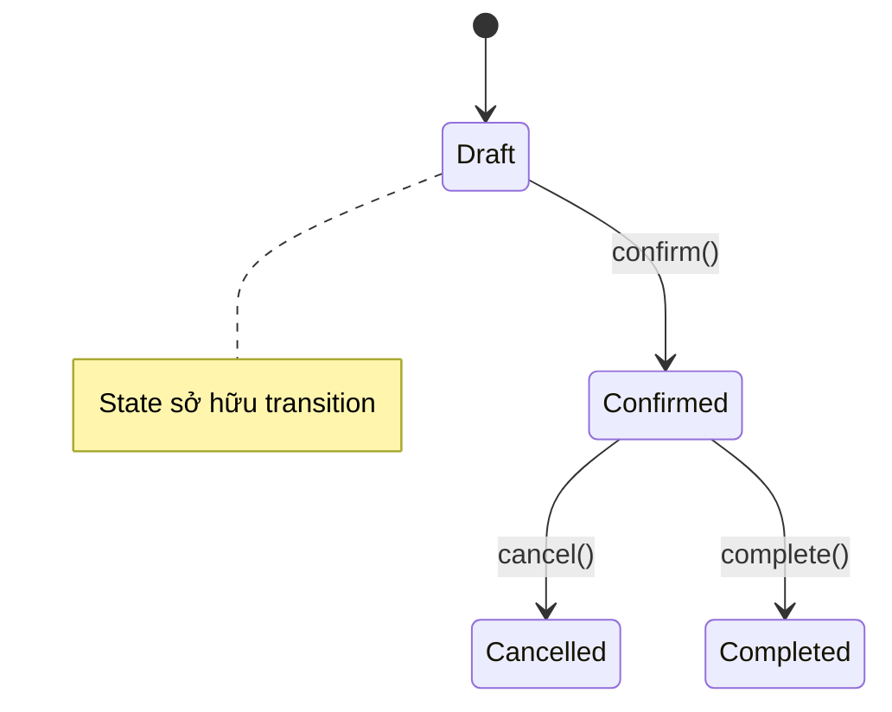
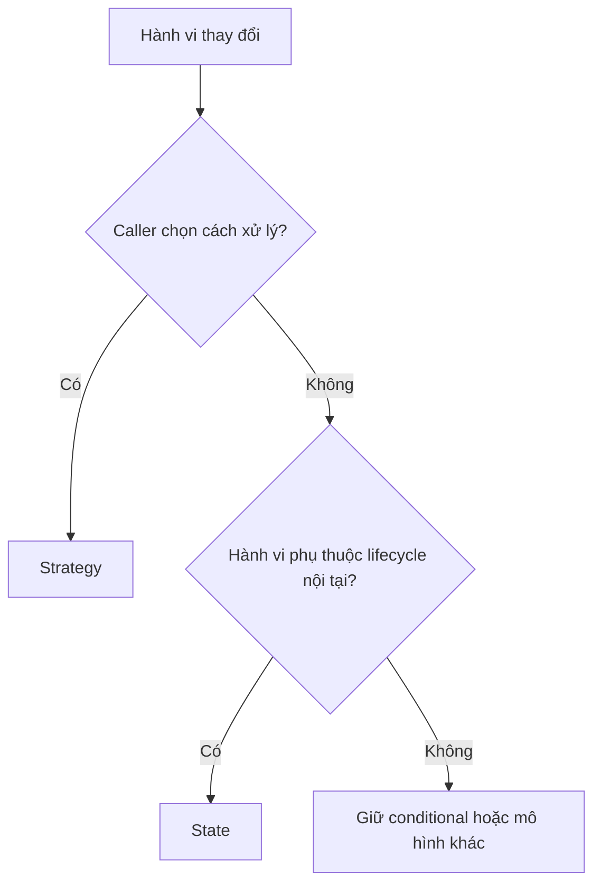
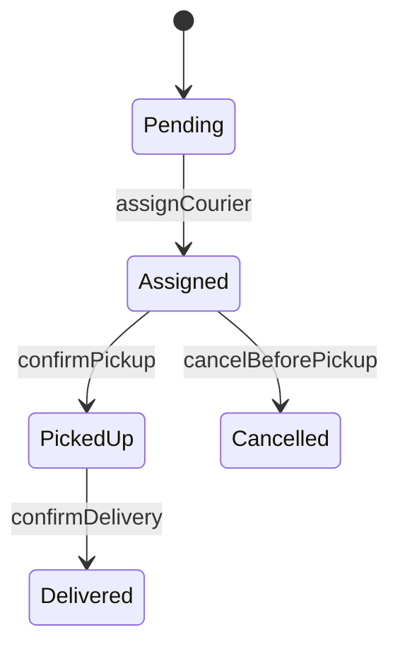

# Strategy và State

## Khác biệt cốt lõi

Strategy thay đổi thuật toán theo lựa chọn của caller; State thay đổi hành vi vì chính object đang ở một trạng thái và transition sang trạng thái khác.

| Tiêu chí | Pattern thứ nhất | Pattern thứ hai |
|---|---|---|
| Ai chọn implementation? | Caller/composition root chọn strategy | Context/state object quyết định transition |
| Điểm thay đổi | Thuật toán, chính sách, cách tính | Lifecycle và hành vi hợp lệ theo trạng thái |
| Test trọng tâm | Contract test cho mọi strategy | Transition table và illegal transition |
| Dấu hiệu chọn sai | Strategy tự đổi lẫn nhau | Caller phải biết và set state ở mọi bước |

## Mô hình cộng tác

## Cây quyết định

## Bài tập phân tích

Thiết kế phí vận chuyển bằng Strategy và vòng đời đơn hàng bằng State. Viết một test chứng minh caller có thể thay shipping policy, và một test chứng minh không thể chuyển trực tiếp từ Draft sang Completed.

## Cách kiểm chứng lựa chọn

1. Test cùng một input qua hai shipping strategy và xác nhận caller chủ động chọn policy.
2. Lập transition table cho order lifecycle, gồm transition hợp lệ và bất hợp lệ.
3. Kiểm tra State object tự quyết định next state thay vì controller set state tùy ý.
4. Ghi điều kiện chuyển Strategy thành conditional hoặc State thành enum nếu số biến thể không tăng.

## Câu hỏi review

- Caller hay object nội tại đang sở hữu việc thay đổi behavior?
- Transition bất hợp lệ được chặn ở đâu?
- Strategy có stateless và thay thế độc lập không?
- State có phát event/side effect sau transition theo transaction boundary đúng không?

## Tình huống production để phân biệt

Một hệ thống giao hàng có thể dùng **Strategy** để chọn chính sách tính phí theo tenant, nhưng dùng **State** để kiểm soát vòng đời `Pending → Assigned → PickedUp → Delivered`. Strategy được chọn từ bên ngoài và không tự chuyển đổi; State thuộc về entity và chỉ cho phép transition hợp lệ.

Khi review, hãy kiểm tra xem class đang biểu diễn **chính sách có thể hoán đổi** hay **lifecycle có luật chuyển trạng thái**. Nếu cả hai cùng xuất hiện, tách policy khỏi state machine thay vì ép một pattern gánh cả hai trách nhiệm.
