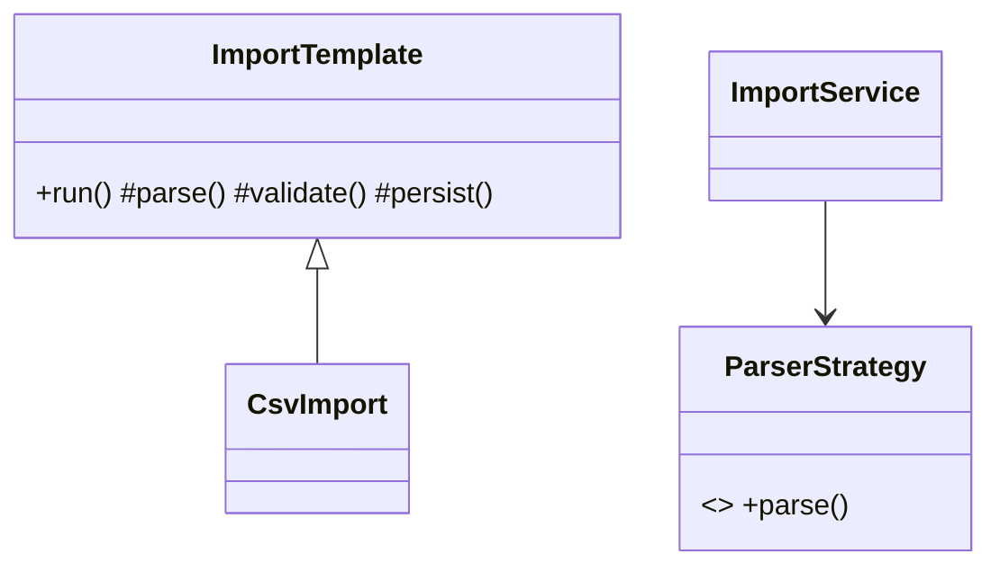
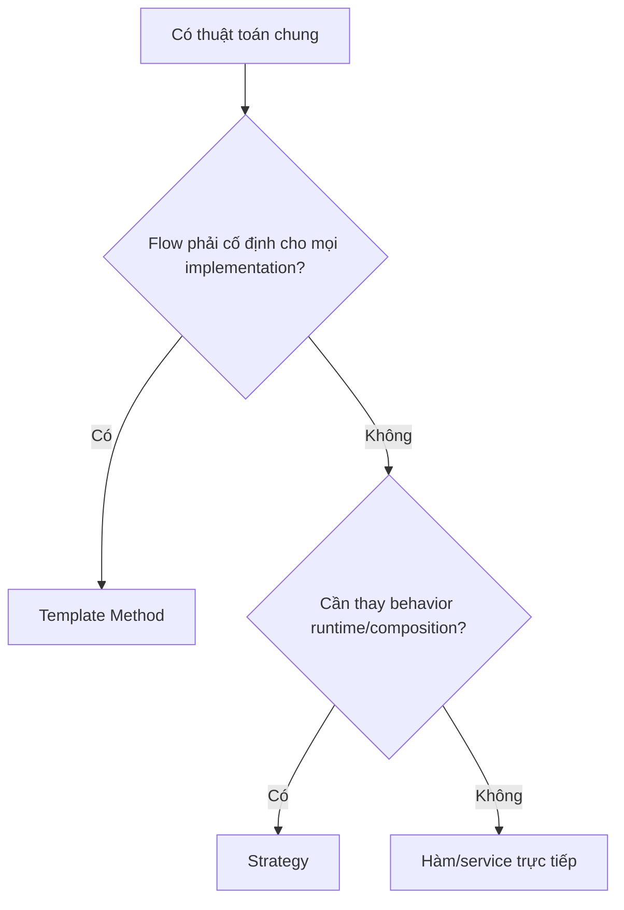

# Template Method và Strategy

## Khác biệt cốt lõi

Template Method cố định skeleton trong base class và cho subclass override hook; Strategy dùng composition để thay toàn bộ hoặc một phần thuật toán.

| Tiêu chí | Pattern thứ nhất | Pattern thứ hai |
|---|---|---|
| Cơ chế | Inheritance + protected hooks | Composition + interface |
| Ai định nghĩa flow | Base class | Context/use case |
| Thay đổi runtime | Khó | Dễ |
| Rủi ro | Fragile base class | Nhiều object nhỏ/wiring |

## Mô hình cộng tác

## Cây quyết định

## Bài tập phân tích

Thiết kế import flow bằng Template Method và parser bằng Strategy. Nêu hook nào không nên expose, và test strategy có thể thay runtime.

## Cách kiểm chứng lựa chọn

1. Test skeleton luôn gọi các bước theo thứ tự và hook không thể bỏ invariant bắt buộc.
2. Tạo subclass override sai để đánh giá fragile base class risk.
3. Thay Strategy runtime và chạy contract test cho mọi parser.
4. So sánh composition với inheritance khi thêm một trục thay đổi thứ hai.

## Câu hỏi review

- Flow có thực sự cố định cho mọi implementation không?
- Hook nào là extension point, hook nào không được override?
- Strategy cần thay runtime hay chỉ cấu hình lúc bootstrap?
- Base class có đang phụ thuộc subclass details không?

## Dấu hiệu chọn sai

Nếu subclass chỉ tồn tại để thay một bước nhỏ nhưng lại phải kế thừa state và hook không liên quan, Template Method đang tạo coupling theo inheritance. Ngược lại, nếu algorithm có skeleton bất biến và client không cần đổi policy lúc runtime, tách mọi bước thành Strategy riêng sẽ làm flow khó đọc. Test Template Method nên khóa thứ tự bước; test Strategy nên dùng contract suite cho mọi policy.
