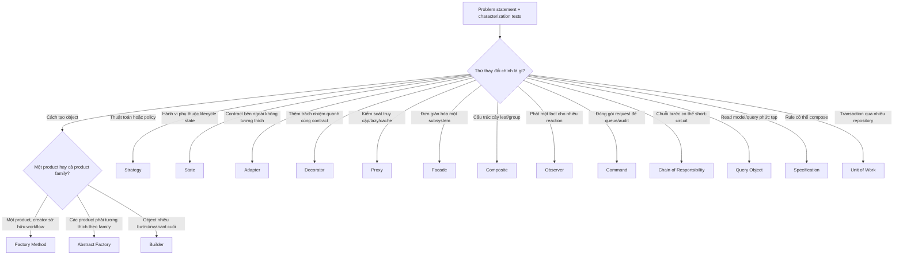
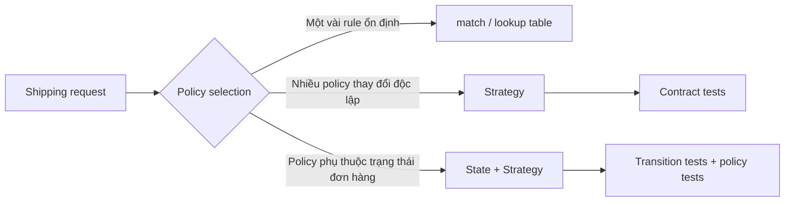

# Decision Tree chọn Pattern

Decision tree này giúp thu hẹp **ứng viên**, không thay thế design review. Điểm bắt đầu luôn là vấn đề và trục thay đổi, không phải tên pattern.

## Cách dùng theo bốn lớp câu hỏi

### 1. Problem

- Lỗi hoặc chi phí thay đổi cụ thể là gì?
- Có characterization test bảo vệ behavior hiện tại chưa?
- Sự thay đổi đã xảy ra hay chỉ là giả định?

### 2. Forces

- Trục thay đổi nằm ở creation, behavior, structure, communication hay persistence?
- Các biến thể có lifecycle và failure semantics riêng không?
- Team có cần deploy/test/observe biến thể độc lập không?

### 3. Alternatives

Với mỗi pattern ứng viên, luôn ghi thêm:

- phương án trực tiếp không pattern;
- pattern lân cận dễ nhầm;
- chi phí class, indirection và debugging;
- cách migration/rollback.

### 4. Evidence

Quyết định chỉ đủ mạnh khi có evidence:

- test cho invariant/failure path;
- dependency graph trước/sau;
- metric về change frequency hoặc incident;
- benchmark khi performance là force thật;
- ADR nêu assumption và revisit condition.

## Ví dụ: hệ thống tính phí vận chuyển

Strategy phù hợp khi policy có thể thay độc lập. Nếu lựa chọn policy phụ thuộc lifecycle của Order, State có thể quản lý transition còn Strategy xử lý thuật toán tính phí.

## Bài tập tương tác

Thiết kế hệ thống notification đa kênh với Email, Chatwork và Slack. Đi qua tree nhưng không được chọn pattern trước khi trả lời:

1. Channel selection là policy hay creation concern?
2. Retry/logging nên nằm trong channel, decorator hay queue middleware?
3. Provider SDK được cô lập tại boundary nào?
4. Nếu delivery async, duplicate và ordering được xử lý ra sao?
5. Baseline nào đủ cho MVP một channel?

### Deliverable

- Một sơ đồ dependency.
- Một ADR so sánh ít nhất hai phương án.
- Bộ test gồm happy path, provider timeout và duplicate request.
- Kết luận khi nào nên quay về giải pháp đơn giản hơn.

## Sai lầm thường gặp

- Chọn pattern theo từ khóa thay vì trục thay đổi.
- Ghép nhiều pattern trong lần refactor đầu tiên.
- Không xác định owner của transaction và side effect.
- Dùng interface cho mọi class dù không có boundary hoặc variant thật.
- Bỏ qua operability: log, metric, alert và runbook.

## Tài liệu liên quan

- [GoF Overview](../../../cheatsheets/gof-overview.md)
- [Pattern Comparison](../../../cheatsheets/pattern-comparison.md)
- [Code Smell to Pattern](../../../cheatsheets/code-smell-to-pattern.md)
- [Pattern Evidence Dossier](../../09-expert-practice/07-pattern-evidence-dossier.md)
