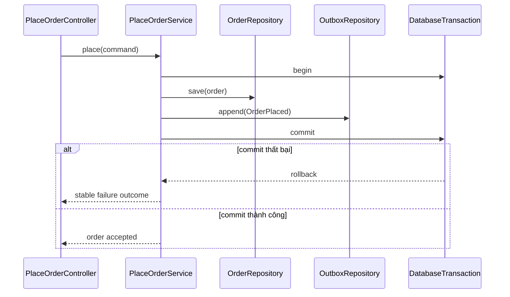

# Quy chuẩn sơ đồ kỹ thuật

Sơ đồ trong handbook phải trả lời một câu hỏi thiết kế cụ thể. Sơ đồ không được dùng để trang trí, thay thế giải thích bằng chữ hoặc che giấu những assumption chưa được kiểm chứng.

## Chọn đúng loại sơ đồ

| Câu hỏi cần trả lời | Loại sơ đồ phù hợp | Không nên dùng |
|---|---|---|
| Thành phần nào phụ thuộc thành phần nào? | Class/component diagram | sequence diagram chỉ có một message |
| Một use case chạy theo thứ tự nào? | Sequence diagram | class diagram không có runtime order |
| Trạng thái nào hợp lệ và transition nào bị cấm? | State diagram | flowchart bỏ qua state ownership |
| Quyết định/routing diễn ra theo nhánh nào? | Flowchart | state diagram nếu không có lifecycle |
| Dữ liệu đi qua boundary nào? | Data-flow/component diagram | danh sách box không có direction |
| Transaction và side effect nằm ở đâu? | Sequence diagram có commit/failure branch | sơ đồ chỉ mô tả happy path |

## Quy tắc cho UML và Mermaid

1. Tên participant phải trùng với khái niệm, port hoặc class được mô tả trong code.
2. Arrow phải thể hiện đúng hướng dependency hoặc message; không dùng arrow hai chiều chỉ vì “có liên quan”.
3. Phân biệt **policy**, **application orchestration**, **adapter** và **external system** bằng tên rõ ràng.
4. Với sequence diagram, thêm `alt`, `opt` hoặc `par` khi failure/concurrency ảnh hưởng thiết kế.
5. Với state diagram, ghi guard hoặc reason cho transition quan trọng; illegal transition phải được nêu trong phần giải thích.
6. Với class diagram, composition/inheritance/dependency phải đúng semantic; không dùng inheritance để biểu diễn “sử dụng”.
7. Framework class chỉ xuất hiện khi lifecycle/framework behavior là nội dung cần học.

## Ví dụ: transaction và outbox

Sơ đồ này cho thấy order và outbox cùng transaction. Nó không khẳng định event đã được broker nhận; publisher là một flow khác.

## Checklist review sơ đồ

- Câu hỏi thiết kế mà sơ đồ trả lời là gì?
- Source of truth và owner của invariant nằm ở đâu?
- Runtime flow có khớp với direction của code không?
- Failure branch quan trọng đã xuất hiện chưa?
- Có participant generic như `Manager`, `Helper`, `Implementation` làm mất intent không?
- Caption giải thích điều cần quan sát, assumption và giới hạn chưa?
- Người chưa đọc bài có thể giải thích lại flow mà không đoán không?

## Bài tập thực hành

Chọn một use case có database và external provider. Tạo ba artifact:

1. Class/component diagram cho dependency tĩnh.
2. Sequence diagram cho happy path và ambiguous outcome.
3. State hoặc flow diagram cho recovery/reconciliation.

Sau đó đối chiếu từng participant với code hoặc contract thật. Xóa mọi box không giúp trả lời câu hỏi thiết kế.

## Tiêu chí hoàn thành

Sơ đồ đạt yêu cầu khi participant, relation và failure semantics khớp implementation; phần chữ giải thích invariant, boundary, assumption và quyết định mà reviewer cần xác minh.
