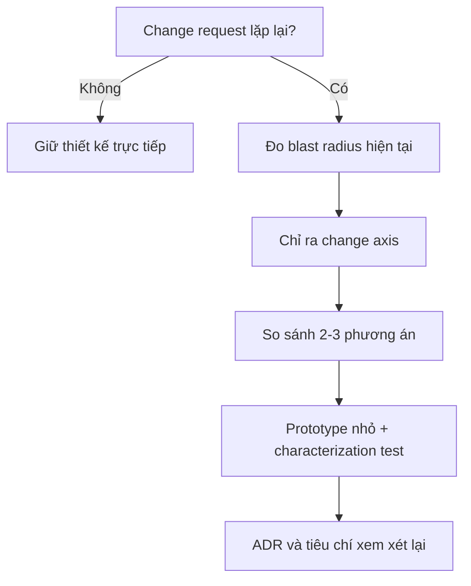

# Pattern adoption bằng bằng chứng

## Vấn đề

Pattern thường được chọn vì quen thuộc hoặc vì “best practice”, trong khi đội ngũ chưa chứng minh được abstraction nào thực sự cần thiết. Kết quả là code có nhiều interface, factory và service nhưng thay đổi nghiệp vụ vẫn chạm nhiều nơi.

## Khung ra quyết định

### Bằng chứng nên thu thập

- Số file/module bị sửa trong ba thay đổi gần nhất.
- Defect hoặc regression liên quan đến cùng một nhánh điều kiện.
- Thời gian test và mức độ khó cô lập dependency.
- Số implementation thực tế, không phải implementation “có thể có”.
- Tần suất thay đổi của policy, provider, workflow hoặc storage.

## Ví dụ

Một hệ thống chỉ có hai phương thức vận chuyển ổn định chưa chắc cần Strategy. Khi bảng giá thay đổi theo quốc gia, khách hàng, SLA và được bổ sung liên tục, Strategy mới có bằng chứng rõ ràng.

## Review checklist

- Pattern giải quyết change axis nào?
- Thiết kế đơn giản nhất không dùng pattern là gì?
- Có dữ liệu hoặc lịch sử thay đổi chứng minh không?
- Khi nào abstraction sẽ bị xóa hoặc gộp lại?

## Bài tập

Chọn một class có nhiều `if/else`, ghi lại ba thay đổi gần nhất, sau đó viết ADR so sánh giữ nguyên, dùng table-driven design và dùng Strategy.

## Evidence tối thiểu

Thu thập change history, defect pattern, dependency graph và benchmark có checksum tương đương. Baseline phải được mô tả rõ để team biết pattern cải thiện điều gì. Sau rollout, đo lead time, defect rate hoặc blast radius thay vì chỉ đếm class.

## Review gate

Không merge abstraction nếu chưa có hypothesis, rollback path và owner. Với migration lớn, dùng branch by abstraction hoặc parallel run để so sánh behavior.
