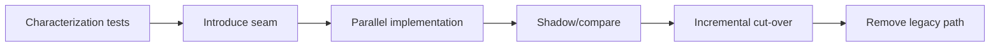

# Migration an toàn sang pattern

## Vấn đề cần giải quyết

Pattern migration thất bại khi team thay cấu trúc và behavior cùng lúc, không có baseline test, hoặc cut-over toàn bộ trong một release. Mục tiêu không phải “đưa pattern vào”, mà là giảm rủi ro thay đổi trong khi giữ output, transaction semantics và khả năng rollback.

## Quy trình migration

1. Khóa behavior hiện tại bằng characterization test và production sample.
2. Tạo seam nhỏ nhất: interface, adapter hoặc façade; chưa đổi business rule.
3. Chạy implementation mới song song hoặc dưới feature flag.
4. So sánh output, error và latency; định nghĩa rollback trigger trước cut-over.
5. Xóa legacy path chỉ sau khi observability chứng minh ổn định.

## Review checklist

- Có dữ liệu nào không thể replay hoặc side effect nào không thể undo?
- Schema/API có cần backward compatibility trong thời gian chuyển đổi?
- Ai sở hữu feature flag và thời điểm xóa nó?
- Test có bao phủ failure path và transaction boundary không?

## Kế hoạch migration

Tách migration thành characterize → introduce seam → dual run → compare → switch → cleanup. Mỗi bước phải deploy độc lập và có rollback. Với dữ liệu, dùng expand–migrate–contract; với event, publish song song và theo dõi consumer adoption.

## Failure rehearsal

Diễn tập timeout, payload mismatch, rollback giữa chừng và stale worker. Migration chỉ hoàn tất khi code cũ, flag và compatibility path được xóa có chủ đích.

## Đo migration thành công

Theo dõi mismatch rate giữa old/new path, rollback count, latency delta và số request còn đi qua compatibility layer. Chỉ cleanup khi metric ổn định qua cửa sổ đủ dài và on-call xác nhận runbook mới hoạt động.

## Bài tập

Lập kế hoạch chuyển một `switch` lớn sang Strategy bằng feature flag. Nêu cách dual run, so sánh output, xử lý side effect và rollback nếu hai implementation khác nhau.
