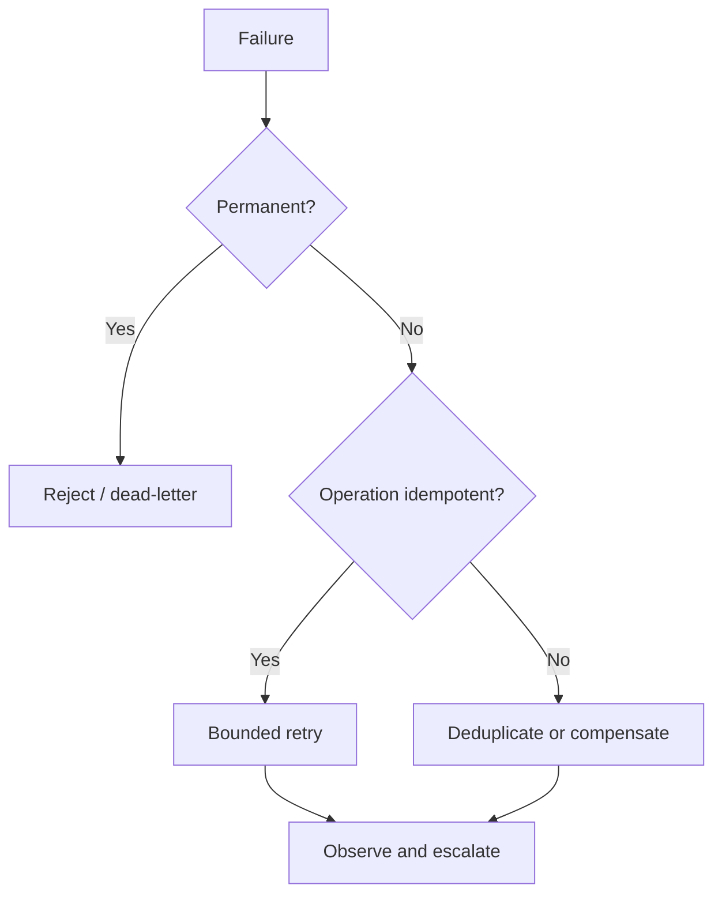

# Thiết kế hướng failure

## Vấn đề cần giải quyết

Happy path không quyết định độ tin cậy của hệ thống; cách hệ thống phản ứng khi timeout, duplicate, partial success và stale data mới quyết định production behavior. Failure-oriented design bắt đầu từ taxonomy lỗi và recovery semantics trước khi chọn retry, fallback hay compensation.

## Failure map

## Khái niệm trọng tâm

- **Transient vs permanent:** timeout khác validation error.
- **Partial success:** dependency đã commit nhưng caller nhận timeout.
- **Idempotency:** retry không nhân side effect.
- **Compensation:** khôi phục business outcome, không giả vờ rollback phân tán.
- **Reconciliation:** phát hiện và sửa divergence sau sự cố.

## Bài tập

Lập failure matrix cho payment webhook: duplicate, out-of-order, signature invalid, DB unavailable và provider timeout. Với mỗi dòng, ghi detection, response, retry owner, idempotency key và metric.

## Failure taxonomy

Phân biệt validation, conflict, dependency timeout, overload, partial commit và unknown failure. Mỗi loại có retryability, ownership và observability khác nhau. Không dùng một `RuntimeException` cho mọi trường hợp.

## Recovery design

Thiết kế idempotency, compensation, reconciliation và manual escalation trước khi thêm retry. Retry không có idempotency có thể nhân đôi side effect.

## Failure matrix

| Failure | Retry? | Compensation | Owner |
|---|---:|---|---|
| Validation | Không | Không | caller |
| Optimistic conflict | Có giới hạn | reload/re-evaluate | application |
| Provider timeout | Tùy idempotency | reconcile | integration |
| Partial commit | Không mù quáng | outbox/recovery | platform |
| Unknown | Sau triage | manual escalation | on-call |

## Bài tập tổng hợp

Vẽ sequence cho payment timeout sau khi provider đã charge. Thiết kế idempotency, reconciliation và trạng thái trung gian để không charge lại mù quáng.

## Review checklist

- Failure có được phân loại thành retryable, conflict hay terminal không?
- Side effect nào cần idempotency key?
- Có reconciliation khi outcome bên ngoài không chắc chắn không?
- Metric và runbook có chỉ ra owner xử lý không?
- Manual recovery có lưu audit trail không?
