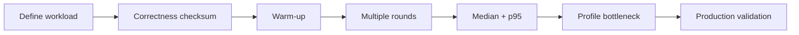

# Phương pháp đánh giá performance của pattern

## Vấn đề cần giải quyết

Micro-benchmark dễ tạo kết luận sai khi workload, warm-up, I/O và allocation không đại diện production. Performance methodology biến câu hỏi “pattern nào nhanh hơn?” thành giả thuyết đo được về latency, throughput, memory và tail behavior.

## Chu trình đo

## Nguyên tắc

- So sánh implementation tạo cùng kết quả.
- Tách CPU-bound, allocation-bound và I/O-bound workload.
- Báo cáo môi trường, PHP version, OPcache/JIT và dataset.
- Dùng profiler để tìm hotspot; benchmark chỉ xác nhận giả thuyết.
- Không đánh đổi correctness/maintainability cho chênh lệch không đáng kể.

## Bài tập

Chọn benchmark Strategy vs `match`, thêm workload nhẹ và nặng, sau đó giải thích tại sao overhead dispatch có thể biến mất khi mỗi strategy thực hiện I/O hoặc calculation đáng kể.

## Phương pháp đo

Xác định workload, warm-up, sample size, environment và checksum. Tách CPU, I/O, allocation và network. Báo median cùng percentile, không chỉ một lần chạy.

## Kiến trúc và performance

Micro-benchmark không quyết định architecture. Đo end-to-end latency, throughput, queue lag và database plan trong điều kiện gần production; sau đó mới cân nhắc bỏ abstraction ở hot path.

## Performance budget

Đặt budget theo user journey hoặc SLO: p95 latency, throughput, memory và error rate. Phân bổ budget cho database, network, serialization và application logic; không tối ưu method dispatch nếu database đang chiếm phần lớn thời gian.

## Bài tập tổng hợp

Thiết kế benchmark cho Repository abstraction trên query thật: dùng fixture cố định, warm cache/cold cache tách biệt, EXPLAIN plan và checksum kết quả. Viết phần “không được kết luận”.

## Review checklist

- Workload có đại diện traffic thật không?
- Kết quả có checksum hoặc assertion tương đương không?
- Warm-up, sample count và môi trường có được ghi lại không?
- Có tách CPU-bound và I/O-bound không?
- Kết luận có giới hạn phạm vi và không biến micro-benchmark thành quyết định kiến trúc không?
