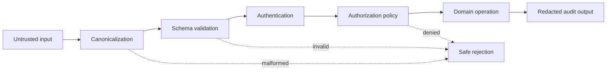
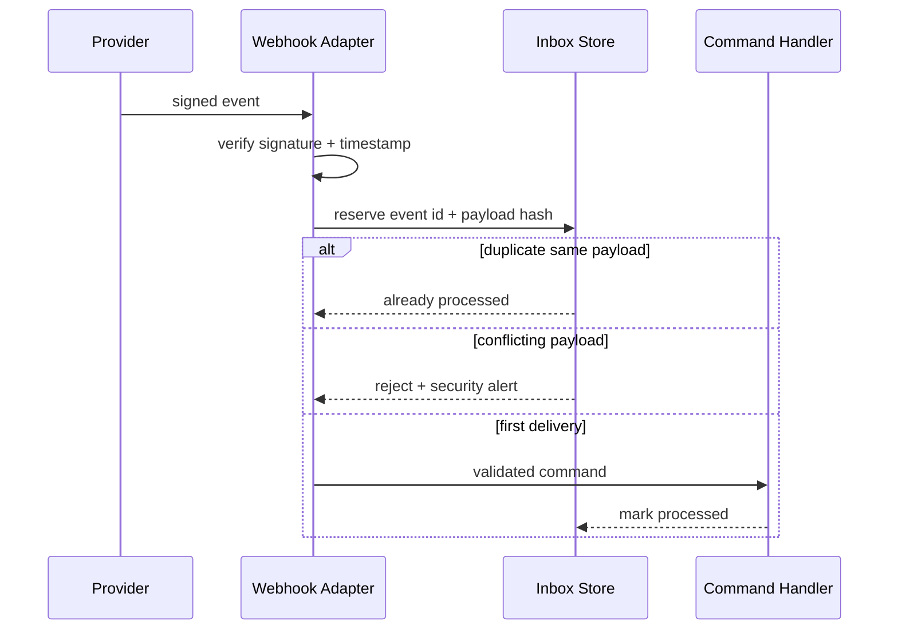

# Security-by-design cho Design Pattern và Abstraction

## Vấn đề cần giải quyết

Design Pattern giúp tách trách nhiệm, nhưng abstraction cũng có thể che khuất authorization, deserialization, tenant boundary và secret handling. Security-by-design đưa threat model vào lúc thiết kế collaboration, thay vì thêm validation rời rạc ở controller sau cùng.

Một thiết kế “đẹp” nhưng cho phép handler được gọi không qua policy, repository đọc xuyên tenant hoặc decorator log token vẫn là thiết kế sai.

## Mô hình đe dọa tối thiểu

### Trust boundary

Mỗi adapter HTTP, queue consumer, webhook receiver hoặc CLI entrypoint là một trust boundary. Dữ liệu chỉ được chuyển thành domain type sau khi:

- canonicalize encoding/format;
- validate schema và size limit;
- xác minh identity/signature;
- kiểm tra tenant/actor context;
- loại bỏ field không được phép.

### Authentication khác authorization

Authentication trả lời “ai đang gọi”; authorization trả lời “actor này được phép thực hiện operation nào trên resource nào”. Command handler hoặc application service quan trọng không được giả định rằng controller luôn kiểm tra đúng.

## Security review theo pattern

| Pattern | Rủi ro | Kiểm soát cần có |
|---|---|---|
| Adapter | mass assignment, error leakage | explicit mapping, allowlist, safe error translation |
| Command | gọi handler ngoài policy | actor context, authorization at use-case boundary |
| Observer | listener nhận dữ liệu quá mức | minimal event payload, data classification |
| Decorator | log secret/PII | redaction, structured logging policy |
| Repository | cross-tenant query | tenant predicate bắt buộc, scoped credentials |
| Proxy | bypass access control | deny-by-default, audited delegation |
| Factory | tạo implementation nguy hiểm từ input | allowlist mapping, không dùng arbitrary class name |
| Memento | snapshot chứa secret | encryption, retention, access logging |

## Abuse case: webhook thanh toán

1. Attacker replay webhook hợp lệ.
2. Signature đúng nhưng timestamp quá cũ.
3. Payload dùng cùng event id với nội dung khác.
4. Log vô tình lưu card token.

Thiết kế cần signature verification, replay window, inbox/idempotency record, payload hash comparison và redaction.

## Verification

- Unit test cho mapping và redaction.
- Contract test với payload vendor thật đã làm sạch.
- Authorization test cho actor/resource matrix.
- Property test: mọi query tenant đều có scope.
- Security test: replay, tampering, oversized payload, unsafe deserialization.

## Checklist production

- Secret không xuất hiện trong exception, metric label hoặc trace.
- Credential có least privilege và rotation plan.
- Event/job schema có version và allowlist.
- Audit log có correlation id, actor, decision, resource và outcome.
- Retention/erasure phù hợp phân loại dữ liệu.
- Runbook mô tả credential compromise và replay attack.

## Bài tập

Thiết kế lại một `PaymentWebhookController` đang trực tiếp deserialize payload và gọi domain service. Nộp threat model, sequence diagram, test matrix và policy redaction; giải thích boundary nào chịu trách nhiệm cho từng kiểm soát.
