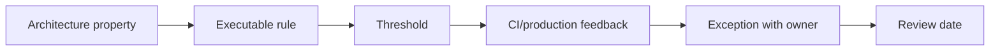

# Architecture Fitness Functions

## Vấn đề cần giải quyết

Kiến trúc thường suy giảm không phải vì một quyết định lớn, mà vì nhiều thay đổi nhỏ vượt qua review. Fitness function chuyển một số thuộc tính kiến trúc thành tín hiệu có thể chạy trong CI hoặc theo dõi ở production.

## Vòng đời fitness function

## Ví dụ trong repository

| Thuộc tính | Fitness function | Failure action |
|---|---|---|
| Dependency direction | Domain không import Infrastructure/framework | Fail CI |
| Documentation quality | Pattern article có problem, trade-off, test và diagram | Fail content audit |
| Source hygiene | Mọi PHP file có `strict_types=1` | Fail source-map audit |
| Reliability | Outbox lag và dead-letter dưới threshold | Alert + runbook |
| API evolution | Contract test cho adapter/event version | Block release |

## Thiết kế rule tốt

Rule cần rationale, owner, phạm vi, exception process và ngày xem xét lại. Tránh metric dễ game như số lượng interface hoặc coverage đơn thuần; ưu tiên behavior và boundary thực sự cần bảo vệ.

## Bài tập

Viết một fitness function phát hiện namespace `Infrastructure` bị import từ `Domain`. Thêm một fixture vi phạm, chứng minh CI fail, rồi ghi trường hợp ngoại lệ hợp lệ và cách phê duyệt.

## Fitness function hữu ích

Kiểm tra forbidden dependency, namespace boundary, event compatibility, migration reversibility và SLO. Rule phải tự động, nhanh và có owner; nếu chỉ tạo false positive, team sẽ bỏ qua.

## Evolution

Mỗi fitness function cần rationale, severity và expiry/review date. Architecture governance tốt là feedback loop, không phải danh sách luật bất biến.

## Ví dụ rule có thể tự động hóa

- Domain namespace không import Laravel/Symfony/Doctrine.
- Integration event phải có schema version.
- Production module phải có runbook link.
- Migration phá compatibility cần ADR.
- Repository write không được gọi từ read-only query handler.

## Bài tập tổng hợp

Chọn ba architecture principle của dự án và chuyển thành test/script có thông báo lỗi actionable. Ghi owner, severity và cách exception được phê duyệt.
