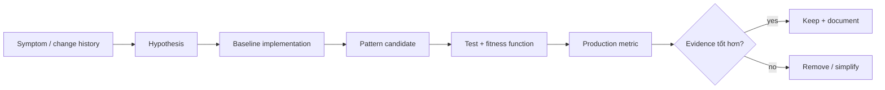

# Pattern Evidence Dossier — Chứng minh một pattern xứng đáng tồn tại

## Mục tiêu

Senior/Tech Lead không nên bảo vệ pattern bằng câu “đây là best practice”. Một **evidence dossier** liên kết vấn đề, quyết định, code, test và dữ liệu vận hành để team có thể kiểm chứng hoặc đảo ngược quyết định.

## Cấu trúc dossier

1. **Context**: use case, owner, change frequency và failure history.
2. **Forces**: các yêu cầu mâu thuẫn như extensibility–latency, consistency–availability.
3. **Baseline**: thiết kế trực tiếp hiện tại và chi phí thực tế.
4. **Candidate**: pattern, boundary và assumption.
5. **Evidence**: testability, diff size khi thêm biến thể, defect rate, latency hoặc incident data.
6. **Revisit trigger**: điều kiện xóa/gộp abstraction.

## Ví dụ: Strategy cho phí vận chuyển

- Symptom: mỗi carrier mới sửa ba controller và hai batch job.
- Baseline: `match` tập trung trong application service.
- Candidate: `ShippingFeePolicy` theo carrier/service level.
- Evidence: thêm carrier thứ ba chỉ thêm class + registration; contract suite chạy cho mọi policy.
- Metric: fallback policy và fee mismatch trong shadow mode.
- Revisit: nếu chỉ còn một carrier ổn định trong 12 tháng, gộp lại.

## Checklist review

- Evidence có phản ánh business outcome hay chỉ đếm số class?
- Baseline có được mô tả công bằng không?
- Pattern giải quyết lực thay đổi nào, không giải quyết gì?
- Metric có thể bị nhiễu bởi rollout hoặc data quality không?
- Có owner và ngày revisit không?

## Bài tập

Chọn một pattern đang có trong dự án. Tạo dossier một trang, kèm một diff mô phỏng thêm biến thể và một fitness function ngăn concrete dependency rò vào domain.

## Review rubric

Dossier tốt trả lời được: vấn đề có thật không, baseline là gì, lựa chọn nào bị loại, migration có reversible không, và metric nào chứng minh kết quả. Dossier yếu chỉ chứa UML đẹp và định nghĩa pattern.
