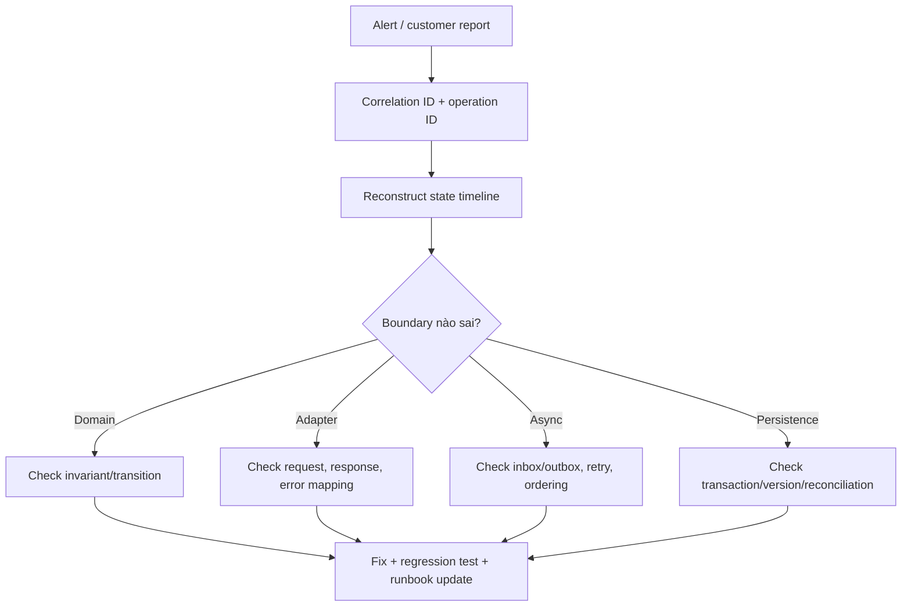

# Production Debugging Playbook cho hệ thống dùng nhiều pattern

## Vấn đề

Pattern làm boundary rõ hơn nhưng cũng tạo thêm lớp gọi. Khi incident xảy ra, debug theo tên class thường chậm. Cần truy vết theo **business operation, state transition và side effect**.

## Luồng điều tra

## Câu hỏi theo pattern

- **Strategy**: policy version nào được chọn và selection context có đúng không?
- **Adapter**: provider trả gì, adapter translate thành gì, raw payload có được redaction/anonymize không?
- **Decorator/Middleware**: order thực tế có giống wiring mong đợi không?
- **Observer/Event**: event id, schema version, consumer offset và retry history là gì?
- **State**: transition command dùng version nào; guard nào reject?
- **Repository/UoW**: transaction commit ở đâu; optimistic lock hoặc partial write có xảy ra không?
- **Saga**: step cuối thành công là gì; compensation nào đã chạy và có idempotent không?

## Telemetry tối thiểu

Mỗi operation quan trọng nên có:

- correlation ID, causation ID và idempotency key;
- domain entity ID + version;
- selected policy/provider;
- transition from/to;
- external reference;
- retry attempt và final disposition;
- metric cho invariant violation và reconciliation mismatch.

## Không nên làm

- Retry thủ công khi chưa biết side effect trước đó có thành công không.
- Sửa dữ liệu trực tiếp mà không append audit/reconciliation record.
- Log toàn bộ payload nhạy cảm.
- Chỉ tăng timeout thay vì phân tích latency budget từng boundary.

## Bài tập

Viết timeline cho incident “gateway timeout nhưng khách bị trừ tiền”. Chỉ ra dữ liệu cần để quyết định retry, reconcile hoặc refund; thêm regression test mô phỏng timeout sau provider success.

## Điều tra có hệ thống

Bắt đầu từ symptom và timeline, sau đó lần correlation/causation id qua adapter, command, event, database và external provider. So sánh expected state machine với state thật; kiểm tra duplicate, out-of-order và partial commit trước khi restart mù quáng.
