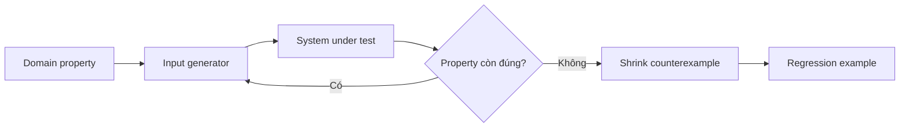

# Property-based Testing cho Domain Invariant

## Vì sao example-based test chưa đủ?

Example test chứng minh một vài input đã biết. Domain quan trọng như tiền, tồn kho, booking và idempotency thường có không gian input lớn; lỗi xuất hiện ở tổ hợp mà team không nghĩ tới. Property-based testing mô tả **điều luôn đúng** và để generator tìm counterexample.

## Mental model



## Property theo domain

| Domain | Property |
|---|---|
| Money | cộng rồi trừ cùng amount trả về giá trị ban đầu |
| Ledger | tổng debit bằng tổng credit |
| Inventory | on-hand = available + reserved + damaged |
| Booking | hai confirmed booking không overlap cùng resource |
| Idempotency | cùng key + cùng payload không tạo side effect lần hai |
| State machine | transition bất hợp lệ không đổi state |
| Serialization | decode(encode(x)) tương đương x |

## Ví dụ PHP dạng khái niệm

```php
for ($i = 0; $i < 1_000; $i++) {
    $a = random_int(0, 1_000_000);
    $b = random_int(0, 1_000_000);

    $money = Money::usd($a);
    $result = $money->add(Money::usd($b))->subtract(Money::usd($b));

    assert($result->equals($money));
}
```

Trong production nên dùng thư viện generator/shrinker, seed cố định khi tái hiện lỗi và lưu counterexample thành regression test.

## Thiết kế generator

- Sinh cả boundary: 0, max, empty, duplicate, timestamp sát nhau.
- Sinh invalid input có chủ đích để kiểm tra rejection.
- Giữ generator gần domain vocabulary, không chỉ random primitive.
- Tránh generator tạo phần lớn dữ liệu vô nghĩa khiến test tốn thời gian.

## Kết hợp với Design Pattern

- Strategy: mọi implementation phải thỏa contract property chung.
- Adapter: round-trip/mapping không làm mất semantic quan trọng.
- State: mọi chuỗi transition giữ invariant.
- Repository: save/load giữ identity và value semantics.
- Decorator: wrapper không thay đổi contract ngoài behavior đã khai báo.

## Failure triage

Khi property fail:

1. Lưu seed và counterexample nhỏ nhất.
2. Xác định lỗi ở generator, property hay implementation.
3. Thêm example regression dễ đọc.
4. Nếu property sai, cập nhật domain glossary/ADR.

## Bài tập

Viết property test cho hệ thống reservation: tổng quantity reserved không vượt stock khả dụng, release hai lần không làm stock tăng thêm, và retry cùng operation id tạo cùng kết quả.
