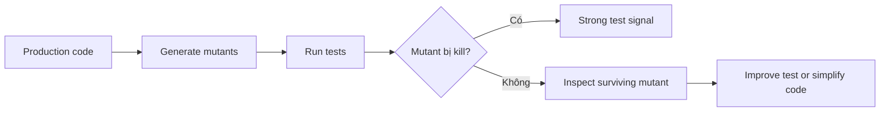

# Mutation Testing để đánh giá chất lượng test và abstraction

## Vấn đề

Coverage 100% không chứng minh test phát hiện lỗi. Mutation testing cố ý thay đổi code—đảo điều kiện, bỏ method call, thay toán tử—rồi kiểm tra test có thất bại hay không.

## Luồng



## Mutant hữu ích theo pattern

| Pattern | Mutation có giá trị |
|---|---|
| Strategy | trả sai strategy, bỏ policy branch |
| State | cho phép illegal transition, bỏ side effect |
| Adapter | bỏ field mapping, đổi error translation |
| Observer | bỏ listener dispatch, đổi ordering |
| Decorator | bỏ delegate call, đảo wrapper order |
| Repository | bỏ identity filter, trả stale object |
| Unit of Work | bỏ rollback, commit thiếu entity |

## Cách đọc mutation score

Không chạy theo con số tuyệt đối. Một mutant sống có thể là:

- test thiếu assertion;
- code không có tác dụng và nên xóa;
- equivalent mutant;
- boundary chưa được định nghĩa rõ.

Ưu tiên domain invariant, authorization, money, concurrency và failure recovery trước getter/setter đơn giản.

## Quy trình với Infection PHP

```bash
composer require --dev infection/infection
vendor/bin/infection --threads=max --min-msi=70
```

Trong CI, chạy mutation test theo module hoặc nightly; không nhất thiết chạy toàn repo cho mọi commit.

## Ví dụ review

Nếu mutation đổi `if ($amount <= 0)` thành `< 0` nhưng test vẫn pass, thiếu case zero. Nếu mutation bỏ `rollback()` mà test vẫn pass, Unit of Work test chưa mô phỏng failure giữa transaction.

## Bài tập

Chọn một implementation Strategy, Adapter và State trong `src/`. Dự đoán 5 mutation nguy hiểm, viết test để kill chúng, sau đó ghi lại mutant nào cho thấy abstraction đang thừa hoặc contract chưa rõ.

## Chiến lược rollout

Bắt đầu ở module domain nhỏ, thiết lập baseline MSI và chỉ fail CI với regression đáng kể. Loại equivalent mutant có giải thích; dùng surviving mutant để tìm assertion yếu hoặc code thừa.

Mutation result nên được lưu cùng module để theo dõi regression qua thời gian.
