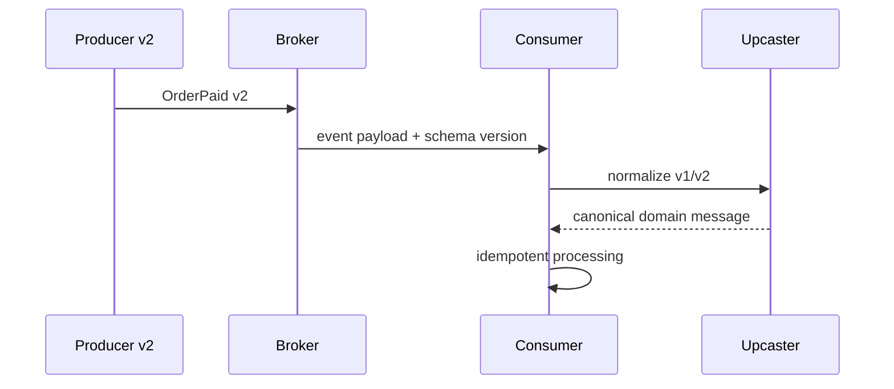

# Event Schema Evolution và Compatibility

## Vấn đề

Event tồn tại lâu hơn deployment tạo ra nó. Producer và consumer có thể chạy khác phiên bản, message có thể nằm trong queue nhiều giờ, được replay từ archive hoặc được đọc bởi team khác. Đổi field tùy tiện sẽ biến event-driven architecture thành coupling ngầm.

## Compatibility matrix

| Thay đổi | Backward compatible | Forward compatible | Gợi ý |
|---|---:|---:|---|
| thêm optional field | thường có | thường có | consumer dùng default |
| đổi tên field | không | không | thêm field mới, deprecate field cũ |
| đổi meaning | không | không | tạo event/version mới |
| thêm enum value | tùy consumer | có thể không | unknown handling bắt buộc |
| xóa field | không | thường có | theo dõi usage trước khi xóa |
| đổi type | không | không | migration adapter/version |

## Luồng versioned consumer

## Nguyên tắc

- Event là fact đã xảy ra, không phải object dump của entity.
- Payload tối thiểu nhưng đủ cho consumer contract.
- Có `event_id`, `occurred_at`, `schema_version`, correlation/causation id.
- Consumer xử lý unknown field và duplicate delivery.
- Versioning policy được ghi trong ADR và contract test.

## Upcaster và parallel publication

Upcaster phù hợp khi consumer cần chuẩn hóa event cũ về canonical model. Với thay đổi lớn, publish song song v1/v2 trong thời gian migration và đo consumer adoption trước khi dừng v1.

## Contract test

- Producer fixture phải được consumer hiện tại đọc được.
- Consumer fixture cũ phải tiếp tục replay thành công.
- Enum unknown không làm worker crash vô hạn.
- Schema registry hoặc fixture repository được review cùng code.

## Failure và observability

Theo dõi deserialize failure, unknown version, dead-letter rate, replay duration và consumer lag theo version. Runbook phải chỉ ra cách quarantine event xấu và rollback producer.

## Bài tập

Thiết kế migration `CustomerEmailChanged v1` sang v2 có thêm tenant, actor và reason. Viết compatibility matrix, sequence rollout, fixture contract test và điều kiện ngừng publish v1.
