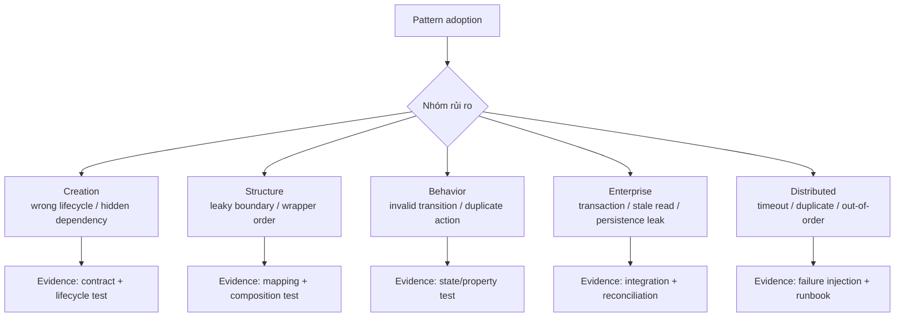

# Pattern Failure Atlas

## Mục tiêu

Pattern Failure Atlas giúp review một pattern bằng **cách nó thất bại**, không chỉ bằng sơ đồ happy path. Đây là bước chuyển từ kiến thức định nghĩa sang năng lực thiết kế production.

## Bản đồ failure theo nhóm pattern

## Failure catalog

| Pattern | Failure thường gặp | Test cần có | Signal production |
|---|---|---|---|
| Factory | factory trở thành switch khổng lồ | creation contract | số case/branch tăng nhanh |
| Adapter | mapping mất dữ liệu hoặc lỗi vendor rò vào core | contract + error mapping | unknown error rate |
| Decorator | wrapper order đổi semantics | permutation/contract test | duplicate retry/log |
| Observer | duplicate/out-of-order delivery | idempotency test | consumer lag, duplicate count |
| State | illegal transition hoặc bypass guard | transition table/property test | rejected transition rate |
| Repository | fake và SQL khác semantics | shared contract suite | pagination/order mismatch |
| Unit of Work | partial commit | integration rollback test | reconciliation discrepancy |
| Outbox | publish lặp hoặc backlog | crash matrix | oldest pending age |

## Cách dùng trong review

1. Nêu pattern và invariant mà nó bảo vệ.
2. Viết ba failure có thể xảy ra ở boundary.
3. Với mỗi failure, ghi detection, containment, recovery và evidence.
4. Nếu không thể kiểm thử failure quan trọng, pattern chưa sẵn sàng production.
5. Ghi trigger phải xem xét lại pattern: volume, latency, team ownership hoặc contract thay đổi.

## Bài tập

Chọn một Adapter hoặc Observer đang có trong codebase. Tạo failure matrix gồm timeout, payload sai, duplicate và dependency unavailable. Viết ít nhất một failure-injection test và một runbook ngắn.

## Failure walkthrough: Observer trong notification

Giả sử `OrderPaid` được publish hai lần vì consumer timeout sau khi gửi email nhưng trước khi ack. Nếu listener chỉ “gửi email” mà không có operation key, người dùng nhận hai thông báo. Thiết kế production cần:

- event ID hoặc business operation ID ổn định;
- inbox/processed-event store ở consumer;
- phân biệt lỗi tạm thời với payload không hợp lệ;
- metric duplicate suppressed và oldest unprocessed age;
- runbook replay theo event ID, không replay toàn partition mù quáng.

Case này cho thấy Observer không chỉ là publisher–subscriber. Delivery semantics và idempotency mới quyết định pattern có an toàn hay không.

## Failure walkthrough: Repository trong reporting

Nếu dùng aggregate repository cho truy vấn báo cáo, team có thể load hàng nghìn aggregate, kích hoạt lazy loading và làm sai ordering/pagination. Đây không phải lỗi implementation nhỏ mà là dấu hiệu chọn sai abstraction. Query Object hoặc read model phù hợp hơn vì contract của nó nói rõ filter, projection và cursor.

## Definition of Done

Một pattern chỉ được coi là production-ready khi:

- failure quan trọng đã có test tái hiện;
- signal phát hiện failure được định nghĩa;
- owner và recovery action rõ;
- trade-off và điều kiện loại bỏ pattern được ghi trong ADR;
- fake/test double giữ cùng semantics với implementation thật.
