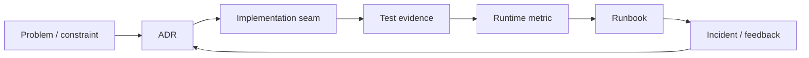

# Design Evidence Review

## Vấn đề

Design review dễ biến thành tranh luận sở thích nếu quyết định chỉ dựa trên tên pattern. Design Evidence Review yêu cầu mỗi lựa chọn phải nối được với problem, alternative, code, test và signal vận hành.

## Evidence graph

## Bộ câu hỏi bắt buộc

### Problem evidence

- Change axis nào đã xuất hiện ít nhất hai lần?
- Failure hoặc coupling hiện tại gây impact gì?
- Baseline trực tiếp đã được thử chưa?

### Decision evidence

- Alternative nào bị loại và vì sao?
- Pattern thay đổi dependency direction hoặc ownership thế nào?
- Chi phí cognitive, migration và vận hành là gì?

### Verification evidence

- Test nào chứng minh invariant?
- Contract test nào bảo đảm adapter/implementation có cùng semantics?
- Metric nào phát hiện assumption sai sau deploy?

### Reversibility evidence

- Rollback seam ở đâu?
- Dữ liệu hoặc event có backward compatible không?
- Khi nào xóa abstraction hoặc đường cũ?

## Rubric

| Mức | Đặc điểm |
|---|---|
| 0 | Chỉ nêu “best practice” hoặc tên pattern |
| 1 | Có problem nhưng không có alternative/evidence |
| 2 | Có code và test, thiếu operability/rollback |
| 3 | Có đầy đủ ADR → test → metric → runbook |
| 4 | Có feedback loop và revisit trigger định lượng |

## Bài tập

Lấy một exercise production. Tạo evidence graph và chấm theo rubric. Nếu dưới mức 3, bổ sung test, metric hoặc rollback plan trước khi coi thiết kế hoàn tất.

## Ví dụ: quyết định dùng Adapter cho payment provider

### Evidence trước quyết định

- SDK trả exception và payload khác contract nội bộ.
- Hai use case đang tự map error theo hai cách khác nhau.
- Provider có khả năng được thay hoặc chạy song song khi migration.

### Evidence sau triển khai

- Contract test chạy với fake và adapter provider thật.
- Mapping table bao phủ success, decline, timeout và unknown response.
- Metric `payment_provider_unknown_error_total` và latency theo provider.
- Feature flag cho phép chuyển cohort về adapter cũ.

Nếu chỉ có một API call nhỏ, mapping ổn định và không có variation, một function trực tiếp có thể tốt hơn Adapter class. Evidence review phải cho phép kết luận **không dùng pattern**.

## Review packet tối thiểu

Một pull request thay đổi kiến trúc nên đính kèm:

1. Problem statement và constraint có số liệu hoặc incident tham chiếu.
2. Sơ đồ before/after với dependency direction.
3. Hai alternative, gồm baseline đơn giản.
4. Test evidence cho invariant và failure path.
5. Migration, rollback và cleanup condition.
6. Metric/dashboard hoặc log field dùng để xác minh sau deploy.
7. Owner và ngày revisit.

## Anti-pattern trong design review

- Dùng số lượng interface/class làm bằng chứng “clean”.
- Chỉ benchmark micro-operation nhưng bỏ qua I/O và operability.
- Nói “dễ mở rộng” mà không chỉ ra extension scenario.
- Chấp nhận diagram nhưng không tìm được code/test tương ứng.
- Không có stop condition cho migration hoặc feature flag.
