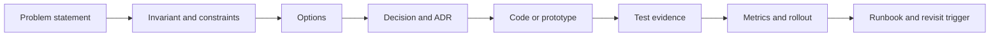

# Architecture Review Packet — Review bằng evidence

## Mục tiêu

Một buổi review kiến trúc tốt không đánh giá số lượng pattern. Nó kiểm tra quyết định có giải quyết đúng lực thay đổi, bảo vệ invariant và có khả năng vận hành hay không.

## Packet tối thiểu

### 1. Problem statement

Mô tả hành vi hiện tại, pain point có bằng chứng và thay đổi dự kiến. Không bắt đầu bằng “chúng ta cần Strategy/Repository/Microservice”.

### 2. Invariant và constraints

Ghi rõ điều không được sai, transaction boundary, latency/SLO, compatibility, security và dữ liệu pháp lý.

### 3. Options

Có ít nhất ba lựa chọn: baseline trực tiếp, pattern đề xuất và một phương án khác. So sánh complexity, migration cost, failure ownership và reversibility.

### 4. Evidence

- characterization/contract/property test;
- benchmark với workload đại diện nếu performance là driver;
- spike/prototype cho integration risk;
- production metric hoặc incident evidence;
- migration rehearsal và rollback proof.

## Câu hỏi review

- Pattern có làm client biết ít implementation detail hơn không?
- Invariant nằm ở đâu và test nào chứng minh?
- Failure sau external success nhưng trước local commit được xử lý thế nào?
- Có hidden coupling qua database/event/schema không?
- Quyết định có thể rollback trong bao lâu?
- Metric nào cho biết abstraction không còn phù hợp?

## Anti-pattern trong review

- Chấp nhận diagram nhưng không có source/test liên kết.
- Dùng “best practice” thay evidence.
- Chỉ review happy path.
- Không chỉ định owner cho migration/runbook.
- Đánh đồng abstraction nhiều với extensibility cao.

## Bài tập

Chọn một module production trong repo, tạo packet một trang và yêu cầu reviewer phản biện bằng failure scenario. Chỉ chấp nhận quyết định khi mỗi claim quan trọng có evidence hoặc assumption được ghi rõ.
