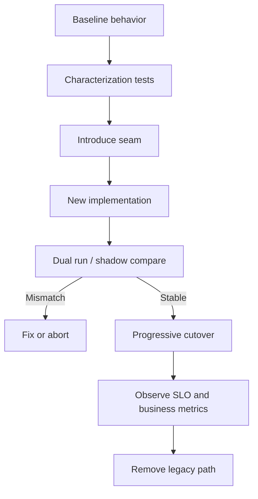

# Real-world Refactoring Dossier — Từ legacy đến pattern an toàn

## Bài toán

Refactoring production không phải thay `if/else` bằng class diagram. Mục tiêu là thay cấu trúc mà không thay đổi behavior ngoài ý muốn, vẫn có rollback và quan sát được sai lệch.

## Luồng migration

## Dossier cần có

### Baseline

- call graph và dependency hotspots;
- business cases đang chạy;
- known defects phải giữ hay sửa;
- latency/error baseline;
- data contract và side effect.

### Safety net

Characterization test cho behavior hiện hữu, contract test tại integration boundary và golden dataset cho calculation/reporting. Với invariant tổng quát, bổ sung property-based test.

### Seam

Chọn seam nhỏ nhất: interface quanh provider, strategy quanh policy, query object quanh read model hoặc state transition service quanh lifecycle. Không tái cấu trúc toàn module trong một bước.

### Dual run

Chạy legacy và implementation mới trên cùng input. So sánh normalized output, side-effect intent và timing; tránh tạo side effect thật hai lần bằng dry-run hoặc idempotency key.

### Cutover

Dùng feature flag/cohort, đặt stop condition và rollback owner. Theo dõi business metric chứ không chỉ CPU/error log.

## Failure rehearsal

- timeout sau provider success;
- duplicate message;
- stale version;
- partial migration;
- incompatible event version;
- rollback khi schema đã expand.

## Khi dossier chưa đạt

- Không biết behavior baseline nào phải giữ.
- Không có cách so sánh legacy và new path.
- Rollback phụ thuộc deploy khẩn cấp.
- Metrics không phân biệt cohort.
- Legacy bị xóa trước khi evidence ổn định.

## Deliverable

Tạo dossier cho một bài exercise production: sơ đồ trước/sau, test inventory, migration steps, feature flag plan, dashboard, runbook và tiêu chí xóa legacy path.

## Review checklist

- Baseline được mô tả bằng behavior và dữ liệu thật, không chỉ bằng class diagram.
- Characterization test phân biệt behavior cần giữ với defect được phép sửa.
- Seam mới không làm thay đổi transaction hoặc side-effect ordering ngoài ý muốn.
- Dual-run có cách ngăn side effect kép và lưu mismatch để điều tra.
- Cutover có cohort, stop condition, rollback owner và thời gian quan sát tối thiểu.
- Legacy path chỉ được xóa sau khi metric, incident và reconciliation evidence ổn định.

## Cách đánh giá kết quả

Một dossier tốt cho phép người không viết code vẫn trả lời được ba câu hỏi: hệ thống đang thay đổi điều gì, bằng chứng nào cho thấy behavior không bị phá vỡ, và cách quay lại an toàn nếu assumption sai. Nếu không trả lời được, migration plan vẫn chỉ là danh sách task chứ chưa phải kế hoạch kỹ thuật có thể vận hành.
