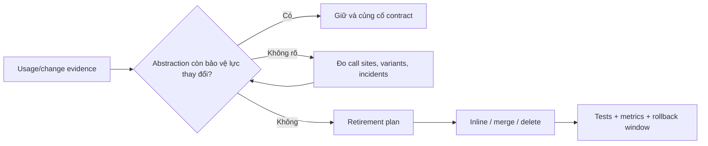

# Abstraction Retirement — Khi nào nên xóa hoặc hợp nhất Pattern

Một abstraction tốt ở thời điểm A có thể trở thành gánh nặng ở thời điểm B. Pattern không phải tài sản vĩnh viễn: khi variation biến mất, ownership thay đổi hoặc framework đã hấp thụ capability, việc giữ hierarchy cũ làm tăng navigation, wiring và cognitive load.

## Vấn đề cần giải quyết

Team thường đo chi phí thêm abstraction nhưng hiếm khi đo chi phí **duy trì** nó. Kết quả là interface một implementation, factory không còn lựa chọn, adapter bọc API đã ổn định hoặc strategy registry chỉ giữ một policy vẫn tồn tại nhiều năm.

## Tín hiệu cần xem xét retirement

- Chỉ còn một implementation trong thời gian dài và roadmap không có variation thực.
- Mọi caller đều biết concrete type dù interface vẫn tồn tại.
- Factory/registry chỉ forward tới một constructor.
- Mapping Adapter gần như identity và vendor contract đã trở thành contract nội bộ.
- Decorator chain cố định, không bao giờ cấu hình hoặc thay order.
- Incident/debug time tăng vì phải đi qua nhiều lớp không tạo decision.
- Test chủ yếu mock interface nhưng không kiểm tra semantics.

## Quy trình retirement an toàn

1. **Thu thập evidence:** số implementation, call site, change history, incident và onboarding feedback.
2. **Xác định contract cần giữ:** invariant, error semantics, metrics và public API.
3. **Tạo characterization tests:** khóa behavior trước khi inline/merge.
4. **Thực hiện parallel change:** đưa caller về implementation trực tiếp hoặc boundary nhỏ hơn.
5. **Quan sát:** so sánh output, latency, error và operational trace.
6. **Xóa code cũ:** chỉ sau khi không còn caller, rollback window kết thúc và documentation được cập nhật.

## Ví dụ: Strategy chỉ còn một policy

Trước đây hệ thống có ba chính sách giá. Sau khi hợp nhất sản phẩm, chỉ còn một policy và selection registry không còn biến thể. Thay vì giữ `PricingPolicyFactory`, registry và ba interface, team có thể:

- giữ một `PricingCalculator` có tên domain rõ,
- giữ test invariant/rounding,
- xóa selection metadata không còn dùng,
- ghi ADR nêu trigger tạo lại Strategy nếu variation quay trở lại.

## Test và evidence

- Characterization test cho output/error.
- Dependency graph trước/sau.
- Static search chứng minh không còn caller/implementation cũ.
- Metric latency/error không xấu đi sau simplification.
- Review onboarding: đường đi code giảm bao nhiêu bước.

## Sai lầm thường gặp

- Xóa interface nhưng giữ nguyên factory/registry vô nghĩa.
- Inline mapping làm technical error rò vào domain.
- Gộp class trong cùng commit với feature change lớn.
- Xóa observability hoặc contract test cùng abstraction.
- Giữ abstraction chỉ vì “có thể tương lai cần lại”.

## Bài tập

Chọn một interface một implementation trong dự án. Viết dossier gồm: lý do ban đầu, change history 12 tháng, contract cần giữ, kế hoạch inline, tests, rollback và trigger tạo lại abstraction.

## Câu hỏi review

- Abstraction đang bảo vệ lực thay đổi nào hôm nay?
- Chi phí navigation/wiring/debug có được đo không?
- Nếu xóa, semantics nào phải giữ nguyên?
- Trigger nào hợp lý để tái giới thiệu pattern?
