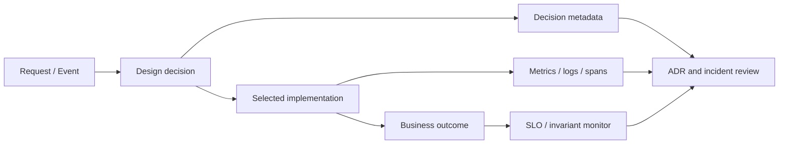

# Design Decision Observability — Quan sát Pattern trong Production

Pattern chỉ hữu ích khi hệ thống vận hành đúng hơn hoặc thay đổi an toàn hơn. Nếu production không cung cấp evidence về decision version, implementation được chọn, transition, retry hay mapping error, team không thể biết abstraction có đang bảo vệ invariant hay che giấu failure.

## Mental model



## Metadata theo nhóm pattern

| Pattern/capability | Metadata nên quan sát |
|---|---|
| Strategy | policy key/version, selector reason, shadow mismatch |
| Factory | product/provider type, creation failure, lifecycle scope |
| Adapter | provider API version, mapping/error class, provider request ID |
| Decorator | wrapper chain, attempt count, short-circuit reason |
| State | from/to state, command, guard/version, rejected transition |
| Observer/Event | event ID/version, subscriber, lag, dedupe result |
| Repository/UoW | aggregate ID/version, transaction outcome, conflict |
| Outbox/Inbox | event ID, pending age, publish attempt, dedupe state |

## Nguyên tắc telemetry

- Log **decision**, không chỉ technical call. Ví dụ `policy_version=2026-08`, không chỉ `PricingService called`.
- Correlation ID nối request, command, event và external operation.
- Error taxonomy ổn định: validation, conflict, temporary, permanent, unknown.
- Metric phản ánh business outcome và invariant, không chỉ HTTP 200 hoặc queue success.
- Không ghi secret/PII; sử dụng identifier và fingerprint phù hợp.

## Ví dụ Strategy rollout

Khi rollout policy giá mới, telemetry tối thiểu:

```text
pricing.policy.served{policy_version, cohort}
pricing.shadow.mismatch{field, severity}
pricing.quote.failure{error_class}
pricing.rollback.trigger{reason}
```

Log/trace cần giữ input fingerprint, selector reason và policy version để tái hiện quyết định mà không lưu dữ liệu nhạy cảm thô.

## Ví dụ Adapter payment

Adapter cần phân biệt:

- provider declined,
- provider temporary failure,
- unknown result do timeout sau request,
- mapping error do schema/status mới.

Dashboard chỉ có “payment failed” sẽ làm operator retry sai và có thể tạo charge trùng.

## Review packet

Một design review production-ready nên có:

1. Decision/invariant được quan sát bằng field hoặc metric nào.
2. Failure nào tạo alert, failure nào chỉ log/sample.
3. Dashboard nào chứng minh rollout an toàn.
4. Runbook nào xử lý unknown/stuck state.
5. Retention/redaction policy.
6. Link ADR → source → test → dashboard → runbook.

## Anti-pattern

- Metric theo class name thay vì business decision.
- Log toàn payload để “debug dễ hơn”.
- Không lưu version/selector reason nên không tái hiện kết quả.
- Alert theo mọi exception gây fatigue.
- Telemetry chỉ ở controller, mất trace qua queue/event.

## Bài tập

Chọn một pattern đang dùng trong production. Vẽ event/trace flow, liệt kê 5 field cần ghi, 3 metric, 2 alert và một runbook. Giải thích mỗi signal hỗ trợ correctness, operability hay decision review.

## Definition of Done

- Có correlation/operation ID xuyên boundary.
- Decision version/implementation được quan sát.
- Invariant có metric hoặc reconciliation check.
- Unknown/stuck state có alert và runbook.
- Telemetry không rò dữ liệu nhạy cảm.
