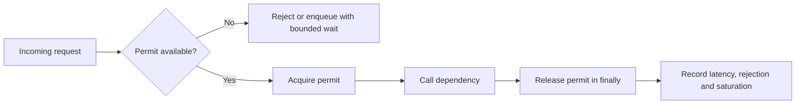

# Bulkhead và Capacity Isolation

Bulkhead giới hạn số tác vụ đồng thời đi vào một dependency hoặc một nhóm tài nguyên. Mục tiêu không phải làm dependency nhanh hơn, mà ngăn một luồng lỗi hoặc chậm tiêu thụ toàn bộ worker, connection hay thread của hệ thống.

## Vấn đề cần giải quyết

Một provider chậm có thể giữ worker quá lâu. Nếu mọi request tiếp tục đi vào cùng provider, queue lag tăng, timeout lan sang capability khác và hệ thống mất khả năng phục vụ ngay cả với các dependency khỏe mạnh. Retry không có admission control còn khuếch đại tải.

## Invariant vận hành

- Số execution đang hoạt động không vượt capacity của bulkhead.
- Permit luôn được trả lại khi operation thành công hoặc ném exception.
- Request bị từ chối phải có error taxonomy rõ, không bị hiểu nhầm là business failure.
- Capacity phải tách theo provider/tenant/capability nếu chúng có blast radius khác nhau.

## Khác gì rate limit và circuit breaker?

- Rate limiter kiểm soát số request theo thời gian.
- Bulkhead kiểm soát số execution đồng thời hoặc số slot tài nguyên.
- Circuit breaker ngừng gọi dependency khi failure rate vượt ngưỡng.

Ba cơ chế có thể phối hợp nhưng không thay thế nhau. Thứ tự thường gặp là rate limit → bulkhead → circuit breaker → adapter. Với request có side effect, retry chỉ được thực hiện sau khi đánh giá idempotency và ambiguous outcome.

## Code có thể chạy

Xem [`Bulkhead`](../../src/Enterprise/Resilience/Bulkhead.php) và [`BulkheadTest`](../../tests/Unit/Enterprise/Resilience/BulkheadTest.php). Implementation trong repo là synchronous in-memory model; production cần semaphore phân tán hoặc process-local concurrency primitive, timeout khi chờ permit và metric saturation.

## Test strategy

1. Permit được trả lại sau success.
2. Permit được trả lại sau exception.
3. Execution vượt capacity bị reject deterministically.
4. Không để một provider dùng permit pool của provider khác.
5. Rejection metric và active gauge luôn cân bằng sau test.

## Production evidence

Dashboard tối thiểu cần active execution, capacity, rejection rate, queue wait và downstream latency. Alert không nên chỉ dựa trên rejection: rejection có thể là cơ chế bảo vệ đang hoạt động đúng. Cần kết hợp saturation kéo dài, error rate và business impact.

## Bài tập

Mở rộng implementation với bounded wait và `Clock` port. Viết test chứng minh timeout khi chờ permit, permit không bị leak và operation không được gọi sau khi hết deadline. Sau đó thiết kế rollout theo một provider có traffic thấp trước khi áp dụng cho provider chính.
