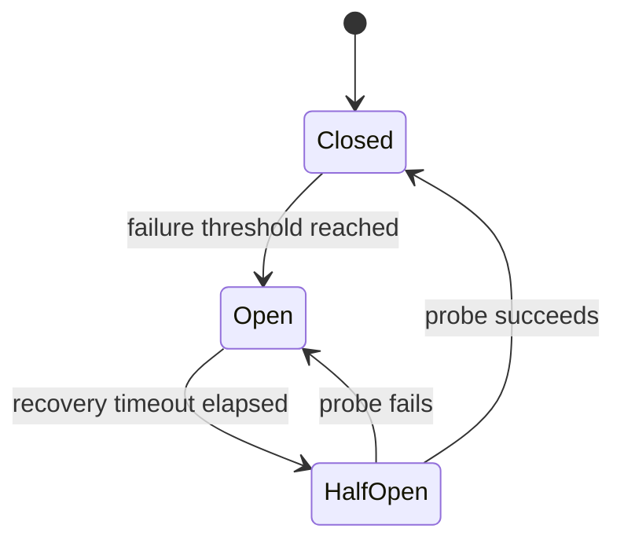

# Circuit Breaker: từ pattern đến khả năng vận hành

## Vấn đề thực tế

Circuit Breaker không phải một wrapper để “retry nhanh hơn”. Nó bảo vệ tài nguyên cục bộ khi dependency đang lỗi, giảm queue growth và tạo tín hiệu vận hành rõ ràng. Thiết kế sai có thể che lỗi, mở circuit toàn tenant hoặc tạo retry storm khi chuyển sang half-open.

## Mental model

## Semantics cần định nghĩa

| Quyết định | Câu hỏi bắt buộc |
|---|---|
| Scope | Circuit theo provider, endpoint, tenant hay operation? |
| Failure classification | Timeout/5xx có tính failure; validation 4xx có nên tính không? |
| Threshold | Theo consecutive failure hay error rate trong sliding window? |
| Half-open | Cho một probe hay giới hạn một nhóm concurrent probe? |
| Fallback | Trả cached response, enqueue later hay fail-fast có typed error? |

## Failure rehearsal

1. Dependency lỗi liên tục và circuit mở đúng threshold.
2. Request khi open bị từ chối mà không gọi dependency.
3. Sau timeout, chỉ probe được phép đi qua.
4. Probe thất bại mở lại circuit; probe thành công reset counter.
5. Metric và log phải nêu dependency, state transition và correlation id.

## Code có thể chạy

Xem [`CircuitBreaker`](../../src/Enterprise/Resilience/CircuitBreaker.php) và [`CircuitBreakerTest`](../../tests/Unit/Enterprise/Resilience/CircuitBreakerTest.php). Implementation cố ý nhỏ để học semantics; production cần sliding window, distributed state decision, metrics và clock abstraction.

## Khi không nên dùng

- Dependency lỗi rất hiếm và fail-fast đã đủ.
- Operation không có fallback/recovery rõ ràng, circuit chỉ đổi loại lỗi.
- Scope circuit không thể xác định an toàn, ví dụ một circuit global làm tenant tốt bị ảnh hưởng bởi tenant lỗi.

## Review checklist

- Failure nào làm tăng counter và failure nào không?
- Circuit state có cần chia theo tenant/provider không?
- Half-open có ngăn thundering herd không?
- Alert dựa trên open duration hay chỉ số lần mở?
- Runbook nói rõ cách kiểm tra dependency và cách đóng/mở thủ công chưa?
