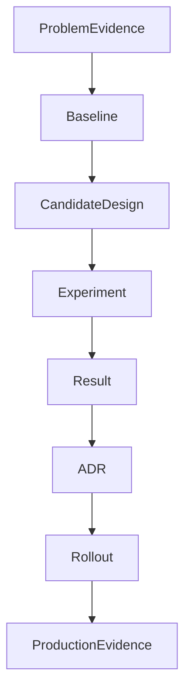

# Pattern Adoption Evidence Pack

Evidence pack biến thảo luận “best practice” thành quyết định có thể kiểm chứng. Nó phù hợp cho thay đổi lớn như thêm Repository, chuyển sang event-driven hoặc tách bounded context.

## Cấu trúc evidence pack

## Nội dung bắt buộc

- Ví dụ thay đổi hoặc incident chứng minh vấn đề hiện tại.
- Baseline trực tiếp và chi phí của baseline.
- Candidate pattern cùng failure mới mà nó tạo ra.
- Prototype hoặc spike có test đại diện.
- Kết quả về lead time, coupling, defect hoặc latency.
- Kế hoạch migration, rollback và tiêu chí gỡ abstraction.

## Ví dụ: thêm Query Object

Evidence không phải “Repository hiện tại khó dùng”. Hãy đưa ba report cụ thể, query plan, số lần aggregate bị load thừa, latency percentile và change history. Spike Query Object phải chứng minh projection rõ hơn, cursor ổn định và không làm write model phụ thuộc reporting schema.

## Review question

Nếu bỏ tên pattern khỏi proposal, evidence còn đủ thuyết phục không? Nếu không, quyết định đang dựa vào uy tín thuật ngữ thay vì nhu cầu hệ thống.

## Điều kiện dừng thử nghiệm

Xác định trước ngưỡng thành công và ngưỡng loại bỏ. Ví dụ Query Object chỉ được mở rộng nếu giảm query coupling hoặc latency có ý nghĩa mà không nhân đôi business rule. Nếu spike không cải thiện evidence đã chọn, quay về baseline và ghi kết quả; không hợp thức hóa pattern vì đã đầu tư công sức.

## Quy trình review evidence

Reviewer đầu tiên kiểm tra problem statement có dữ liệu thật hay chỉ là cảm giác. Reviewer thứ hai đối chiếu candidate với baseline đơn giản hơn. Owner vận hành xác nhận metric, alert và rollback có thể dùng được. Sau rollout, team phải cập nhật evidence bằng kết quả production; ADR không kết thúc ở ngày merge. Nếu assumption đổi, evidence pack trở thành đầu vào cho quyết định thu hồi hoặc thay thế abstraction.
