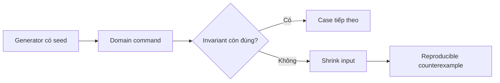

# Property-based Testing Workbook cho Domain Invariant

Property-based testing không thay thế example-based test. Nó bổ sung khả năng khám phá các tổ hợp dữ liệu mà người viết test khó liệt kê hết, đặc biệt hữu ích với `Money`, discount, stock reservation và khoảng thời gian booking.

## Mental model



Một property tốt phải mô tả quy luật nghiệp vụ ổn định, không mô tả chi tiết implementation. Seed phải được in ra để lỗi có thể tái hiện trên CI và máy cá nhân.

## Money

Các property quan trọng:

- `a + 0 = a` với cùng currency.
- `(a + b) - b = a` khi không âm.
- Cộng tiền khác currency luôn thất bại.
- Kết quả không làm thay đổi object đầu vào.

## Discount

Property nên kiểm tra:

- Giá sau giảm không âm.
- Discount 0% giữ nguyên giá.
- Discount bị giới hạn bởi policy tối đa.
- Việc áp dụng cùng một coupon idempotency key hai lần không nhân đôi lợi ích.

## Stock

Với chuỗi reserve/release ngẫu nhiên:

```text
on_hand = available + reserved
available >= 0
reserved >= 0
```

Generator phải tạo cả command hợp lệ và command cố tình vượt tồn kho để kiểm tra rejection không làm thay đổi ledger.

## Booking overlap

Với khoảng nửa mở `[start, end)`, hai booking không overlap khi `endA <= startB` hoặc `endB <= startA`. Property cần bao phủ các biên bằng nhau, booking lồng nhau và timezone đã chuẩn hóa.

## Cách chạy workbook

```bash
php expert-labs/property-based-invariants/run.php 20260802 500
```

Tham số thứ nhất là seed, tham số thứ hai là số case. Khi lỗi, runner in seed, case và input tối thiểu tìm được.

## Review checklist

- Property có bắt nguồn từ invariant nghiệp vụ không?
- Generator có tạo boundary và invalid case không?
- Failure có tái hiện bằng seed không?
- Test có tránh phụ thuộc thời gian/ngẫu nhiên không kiểm soát không?
- Counterexample có đủ nhỏ để chẩn đoán không?
