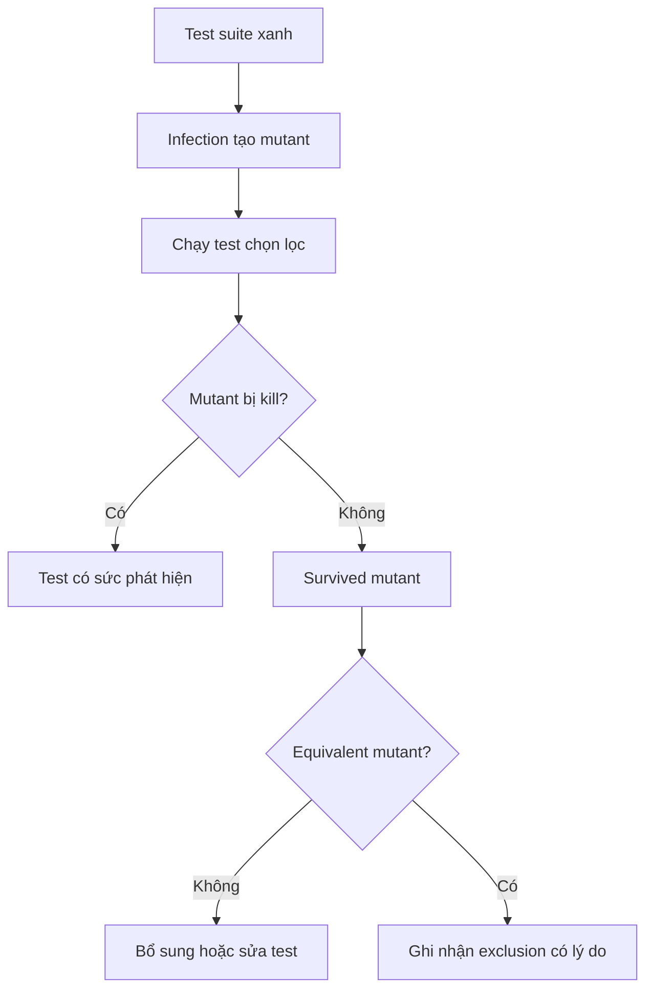

# Mutation Testing với Infection

Coverage chỉ cho biết dòng code đã chạy; mutation testing kiểm tra test có phát hiện khi hành vi bị thay đổi sai hay không. Đây là công cụ đặc biệt phù hợp cho policy, state transition, validation, idempotency và calculation.

## Luồng đánh giá



## Mutant có giá trị cao

- Đổi `>` thành `>=` ở booking overlap.
- Bỏ kiểm tra currency trong `Money`.
- Đổi state transition hợp lệ thành no-op.
- Bỏ idempotency payload hash comparison.
- Không decrement permit trong `finally` của Bulkhead.

## Cấu hình đề xuất

Repository có `infection.json5.example` làm baseline. Chỉ mutate `src/`, giới hạn thread theo CI capacity và lưu MSI/covered MSI như artifact.

```bash
composer require --dev infection/infection
vendor/bin/infection --configuration=infection.json5.example --threads=4
```

Không nên chạy mutation toàn repo trong mỗi commit nhỏ. Chạy trên module thay đổi ở PR, toàn bộ trên nightly hoặc release gate.

## Cách đọc kết quả

Survived mutant không tự động đồng nghĩa test kém. Trước khi thêm test, xác định mutant có thay đổi observable behavior hay chỉ tương đương về semantics. Ưu tiên mutant ảnh hưởng invariant, tiền, tồn kho, quyền truy cập và side effect.

## Definition of Done

- Critical policy đạt MSI mục tiêu đã thỏa thuận.
- Survived mutant có owner và disposition.
- Exclusion có comment giải thích.
- Test mới diễn đạt business rule, không chỉ kill mutant bằng assertion nội bộ.

## Workflow thực tế theo pull request

Trước khi chạy Infection, chọn phạm vi thay đổi và xác định mutant nào đại diện cho rủi ro nghiệp vụ. Với `Money`, ưu tiên toán tử số học và currency guard. Với State, ưu tiên transition guard. Với repository, ưu tiên nhánh missing aggregate và version comparison. Chạy PHPUnit trước để bảo đảm baseline xanh, sau đó chạy Infection trên namespace hoặc file liên quan nhằm giữ feedback time ngắn.

Khi mutant sống sót, reviewer cần phân loại ba trường hợp. Thứ nhất, test thiếu assertion có ý nghĩa; bổ sung test theo business behavior. Thứ hai, source chứa dead branch hoặc abstraction không quan sát được; cân nhắc xóa code thay vì thêm test giả tạo. Thứ ba, mutant tương đương; ghi exclusion hẹp và giải thích vì sao observable behavior không đổi.

## CI strategy

PR nhỏ chạy mutation theo changed files hoặc module. Nightly chạy toàn bộ source và lưu report HTML làm artifact. Release gate theo dõi MSI theo module, không chỉ trung bình toàn repo, vì một module payment có rủi ro khác cheatsheet demo. Khi MSI giảm, pipeline phải chỉ ra mutant cụ thể và owner thay đổi.

## Anti-pattern

Không viết assertion vào private method chỉ để kill mutant. Không đặt mục tiêu 100% MSI nếu chi phí tạo test vượt giá trị rủi ro. Không loại trừ cả namespace chỉ vì một vài equivalent mutant. Mutation testing là feedback về sức mạnh test và độ quan sát của thiết kế, không phải trò chơi tối ưu điểm số.
