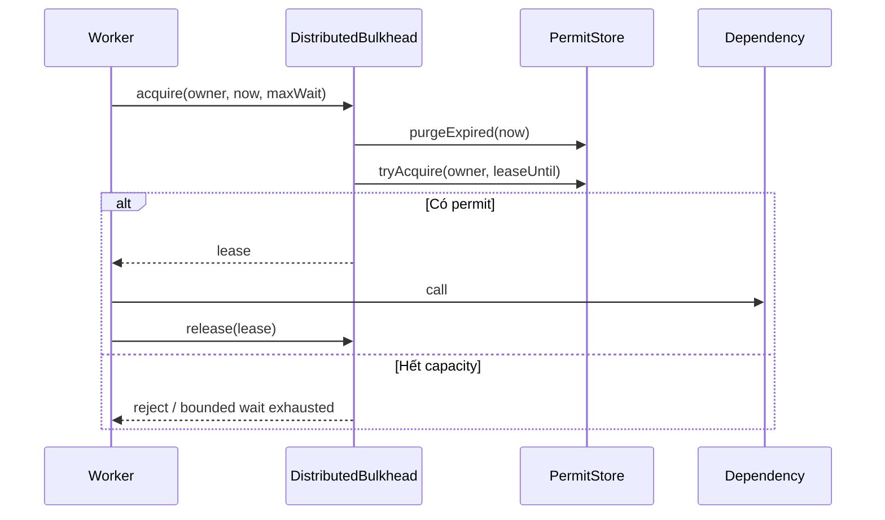

# Distributed Bulkhead và Bounded Waiting

Bulkhead trong một process không bảo vệ dependency khi workload chạy trên nhiều worker. Distributed bulkhead cần một permit store dùng chung, lease có TTL và giới hạn thời gian chờ rõ ràng.

## Kiến trúc tham chiếu

## Invariant

- Số lease còn hiệu lực không vượt capacity.
- Release chỉ áp dụng cho đúng token.
- Worker chết không giữ permit vô hạn; TTL giải phóng lease.
- Bounded waiting không biến bulkhead thành queue không giới hạn.

## Quyết định production

Redis có thể dùng Lua script để purge expired lease và acquire atomically. Database có thể dùng row locking nhưng phải đo contention. Clock skew cần được giảm bằng server-side time hoặc safety margin.

## Failure cần diễn tập

- Worker chết sau acquire.
- Release request bị mất.
- Permit store timeout sau khi acquire thành công.
- Lease hết hạn trong khi dependency call còn chạy.
- Retry tạo hai owner token khác nhau.

Source minh họa nằm tại `src/Enterprise/Resilience/DistributedBulkhead/`; implementation in-memory dùng để học semantics, không phải distributed coordination thật.

## Bounded waiting

Một bulkhead có thể reject ngay hoặc cho phép chờ trong ngân sách nhỏ. Nếu có waiting queue, phải giới hạn cả số waiter và thời gian chờ. Request hết deadline phải rời queue trước khi nhận permit; nếu không, hệ thống tạo work đã vô nghĩa và tăng tail latency. Fairness cũng cần quyết định rõ: FIFO dễ hiểu nhưng có thể gây head-of-line blocking; priority queue có nguy cơ starvation.

## Lease renewal và fencing

TTL giải quyết worker chết nhưng tạo rủi ro lease hết hạn khi operation còn chạy. Với side effect critical, permit token nên mang fencing number tăng dần; dependency hoặc persistence layer từ chối token cũ. Renewal chỉ nên xảy ra khi owner còn sống và deadline tổng chưa hết. Không kéo dài lease vô hạn bằng heartbeat không có budget.

## Observability

Theo dõi active permits, saturation ratio, rejection count, wait duration, lease expiry và owner distribution. Alert trên saturation kéo dài kết hợp error rate, không alert chỉ vì một lần full capacity. Runbook phải cho biết dependency nào được bảo vệ, cách giảm concurrency, cách phát hiện leaked lease và khi nào fail open/fail closed.

## Test strategy

Ngoài unit test, cần concurrency test cho acquire đồng thời, expiry test với fake clock, token ownership test và failure-injection sau acquire trước release. Production adapter Redis/database cần integration test atomicity. In-memory implementation trong repo chỉ chứng minh semantics; nó không mô phỏng network partition hoặc multi-process race.
