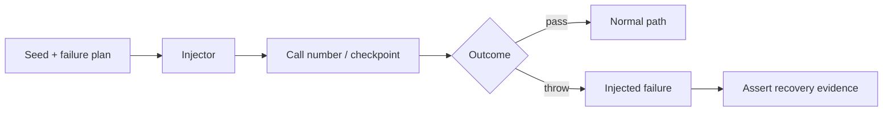

# Deterministic Failure Injection

Failure injection có giá trị khi cùng seed luôn tạo cùng chuỗi lỗi. Điều này cho phép CI tái hiện timeout, ambiguous outcome và partial failure mà không biến test thành flaky.



## Thiết kế failure plan

Plan phải mô tả checkpoint nghiệp vụ, không phụ thuộc số dòng code. Ví dụ:

- `payment.before-provider`
- `payment.after-provider-before-persist`
- `outbox.after-publish-before-mark`
- `booking.after-hold-before-confirm`

Mỗi rule có seed, xác suất hoặc danh sách lần gọi, và failure kind. Test nên assert state, side effect, retry decision, reconciliation record và metric.

## Chạy lab

```bash
php expert-labs/failure-injection/run.php 42
```

Lab mô phỏng external success nhưng persistence failure, sau đó yêu cầu reconciliation thay vì blind retry.

## Cảnh báo

Không đưa injector vào production path nếu không có feature flag, authorization và audit. Không dùng randomness không seed trong CI. Không chỉ assert exception; phải assert trạng thái phục hồi.

## Failure matrix

Một capability nên có bảng checkpoint × failure kind × expected recovery. Payment có thể fail trước provider, sau provider trước persistence, sau persistence trước response và sau outbox publish trước mark. Mỗi vị trí có semantics khác nhau: retry an toàn, ambiguous outcome, replay response hoặc duplicate delivery. Dùng cùng exception cho mọi checkpoint sẽ che mất quyết định nghiệp vụ.

## Thiết kế injector

Injector nên nhận `FailurePlan` bất biến, checkpoint name và call context. Plan có thể chọn fail-on-call, modulo theo seed hoặc sequence outcome. Test in seed và plan khi thất bại. Không để production code tự đọc random global state vì không tái hiện được. Với async flow, truyền scenario ID qua message metadata để nhiều process dùng cùng plan một cách có kiểm soát.

## Assertion sau failure

Sau khi inject lỗi, kiểm tra database state, external side effect ledger, outbox/inbox, retry count, reconciliation item và metric. Một test chỉ thấy exception là chưa đủ. Nếu provider đã success nhưng local state chưa commit, expected result có thể là `unknown` và manual/automatic reconciliation, không phải `failed`.

## Vận hành an toàn

Failure injection ở staging nên có allowlist tenant, rate limit, audit log và kill switch. Trong production game day, bắt đầu với read-only hoặc non-critical traffic, đặt abort threshold và có người quan sát dashboard. Mọi experiment phải tạo evidence packet: hypothesis, blast radius, expected signals, actual signals và follow-up action.
