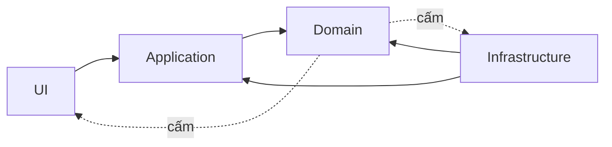

# Architecture Fitness Functions trong CI

Fitness function biến quy tắc kiến trúc thành kiểm tra có thể chạy. Quy tắc tốt nhỏ, rõ lỗi, có owner và phản ánh rủi ro thực tế.

## Dependency rule



Repository bổ sung `scripts/audit-architecture-fitness.php` để kiểm tra:

- Domain không import Infrastructure hoặc Framework.
- PHP source dùng `declare(strict_types=1)`.
- Production module có diagram và failure model.
- Source enterprise quan trọng có test hoặc smoke evidence.

```bash
php scripts/audit-architecture-fitness.php
```

## Thiết kế gate

Gate phải cung cấp đường dẫn file, rule bị vi phạm và cách sửa. Exception phải có expiry date và ADR. Không biến naming preference thành hard gate nếu không bảo vệ rủi ro.

## Mở rộng

- Event schema compatibility.
- Forbidden synchronous dependency giữa bounded context.
- Max public API surface.
- Controller không chứa transaction/business policy.
- Outbox bắt buộc cho integration event sau commit.

## Phân loại fitness function

Structural function kiểm tra dependency và public API. Behavioral function chạy contract test hoặc architecture smoke flow. Evolutionary function kiểm tra schema/event compatibility giữa phiên bản. Operational function yêu cầu metric, alert hoặc runbook cho capability critical. Không nên gộp tất cả vào một script khó hiểu; mỗi rule cần tên, owner và thông báo sửa lỗi.

## Exception governance

Có trường hợp migration tạm thời cần vi phạm rule. Exception phải nằm trong file machine-readable, có lý do, owner và ngày hết hạn. CI cảnh báo trước expiry và fail sau expiry. Exception không được dùng để biến rule thành optional vĩnh viễn. Khi rule tạo quá nhiều false positive, sửa rule hoặc phạm vi thay vì thêm allowlist hàng loạt.

## Rollout

Bắt đầu ở chế độ report-only để đo baseline. Phân loại violation thành legacy debt và regression mới. Chặn regression mới trước, sau đó giảm debt theo module. Mỗi lần nâng strictness cần migration plan và changelog. Fitness function tốt làm feedback nhanh hơn review thủ công, nhưng reviewer vẫn phải đánh giá semantics mà static rule không nhìn thấy.

## Ví dụ mở rộng

Có thể parse namespace để cấm Domain phụ thuộc Infrastructure, kiểm tra Controller không gọi ORM trực tiếp, xác nhận integration event có version, hoặc so sánh OpenAPI schema. Với PHP, PHPStan custom rule và PHPUnit architecture test có thể bổ sung script filesystem. Gate nên chạy dưới vài giây ở PR; rule nặng chuyển sang nightly.
