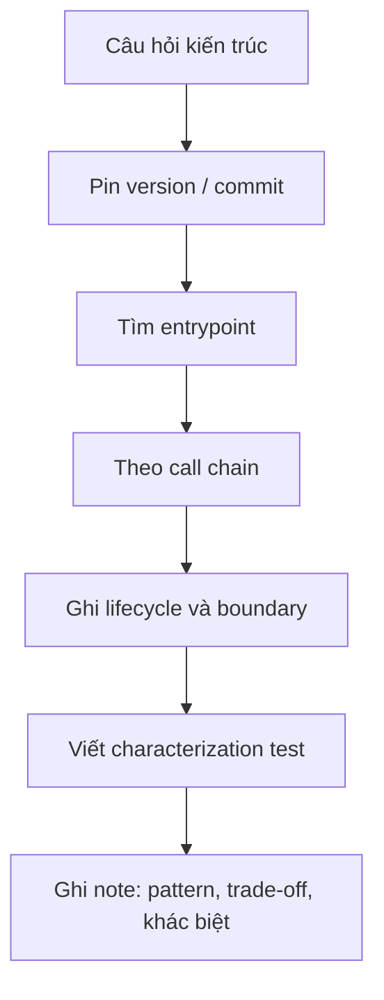

# Framework Source Tour Protocol

Source tour giúp người học phân biệt pattern được mô tả trong sách với implementation thật trong framework. Tour phải pin tag hoặc commit để link không trôi theo thời gian.

## Quy trình

## Laravel tour

Các tuyến gợi ý:

- Container: binding → resolution → contextual binding → lifecycle.
- Queue: dispatch → serialization → middleware → worker → failed job.
- Events: dispatcher → listener resolution → queued listener → after-commit.
- Eloquent: model event → relation loading → transaction implication.

## Symfony tour

- DependencyInjection: definition → compiler pass → compiled container.
- Messenger: envelope → middleware stack → transport → handler locator.
- EventDispatcher: listener priority → propagation stop.
- Doctrine bridge: manager registry → EntityManager → Unit of Work → flush.

## Artifact bắt buộc

Mỗi tour tạo `source-tour.md`, call graph Mermaid, ba observation, một characterization test và danh sách “framework behavior không nên leak vào domain”. Không copy dài source code; trích đoạn ngắn và ghi file/line theo commit đã pin.

## Chuẩn bị trước tour

Viết câu hỏi hẹp trước khi mở source, ví dụ “queued listener được resolve ở đâu và retry metadata đi qua object nào?”. Ghi version PHP, framework tag, commit hash và extension quan trọng. Tạo một ứng dụng tối thiểu để chạy characterization test; không dựa hoàn toàn vào đọc tĩnh vì lifecycle thường chỉ rõ khi container/worker thực thi.

## Cách theo call chain

Bắt đầu từ public API mà application gọi, tìm interface/contract, sau đó theo implementation đến boundary cuối. Ghi lại object được tạo ở đâu, state sống bao lâu, transaction bắt đầu/kết thúc ở đâu và exception được translate tại lớp nào. Nếu gặp code generation hoặc compiled container, inspect artifact sinh ra thay vì đoán.

## Source note chất lượng cao

Note phải tách ba lớp: observable contract, implementation detail và upgrade risk. Một internal method không phải contract chỉ vì hiện tại test gọi được. Trích đoạn tối đa cần thiết, ưu tiên link file/line theo commit. Vẽ sequence có participant thật và ghi branch failure.

## Review sau tour

So sánh phát hiện với abstraction trong project. Nếu project wrap framework, wrapper bảo vệ contract nào? Nếu không có rủi ro thay đổi hoặc test seam, wrapper có thể thừa. Mỗi tour kết thúc bằng một test, một documentation correction hoặc một ADR; chỉ đọc source mà không tạo evidence thì khó tái sử dụng cho team.
