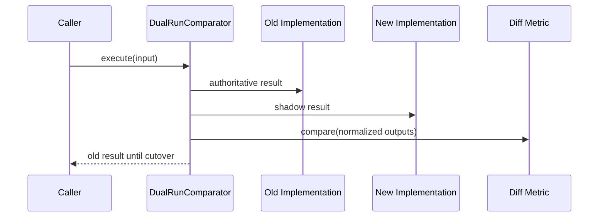

# Migration Rehearsal với Dual-run và Shadow Comparison

Migration an toàn cần đo tính tương đương trước khi cutover. Dual-run chạy baseline và implementation mới trên cùng input; shadow comparison lưu diff nhưng chỉ một nhánh tạo side effect authoritative.

## Quy tắc side effect

- Chỉ nhánh authoritative được ghi payment, gửi email hoặc mutate stock.
- Nhánh shadow dùng dry-run port hoặc sandbox.
- Normalize timestamp, generated ID và ordering trước khi diff.
- Lưu sample diff có redaction.

Source minh họa tại `src/Enterprise/Migration/DualRunComparator.php` và test tương ứng.

## Cutover gate

- Diff rate dưới threshold theo cohort.
- Không có diff ở invariant critical.
- Latency và resource budget đạt yêu cầu.
- Rollback command đã rehearsal.
- Cleanup old path có owner và deadline.

## Kiểu comparison

Exact comparison phù hợp value deterministic. Semantic comparison normalize generated ID, timestamp, ordering hoặc precision. Invariant comparison chỉ kiểm tra rule critical khi output shape khác hoàn toàn. Chọn comparator trước khi chạy để tránh hợp thức hóa diff sau khi thấy kết quả.

## Sampling và cohort

Không cần shadow 100% traffic ngay. Bắt đầu cohort nội bộ hoặc tenant ít rủi ro, dùng deterministic sampling theo entity ID để một entity luôn đi cùng cohort. Theo dõi diff rate theo input category, không chỉ tổng trung bình; edge case hiếm có thể bị che bởi volume lớn của happy path.

## Side-effect safety

Shadow implementation phải dùng dry-run adapter, transaction rollback hoặc sandbox account. Với email/payment không có dry-run an toàn, compare decision object trước side effect thay vì gọi provider hai lần. Gắn correlation ID để trace old/new path mà không trộn metric authoritative với shadow.

## Cutover và cleanup

Cutover nên progressive, có feature flag và rollback command đã thử. Sau cutover, giữ old path trong thời gian quan sát có giới hạn; đặt deadline xóa để tránh permanent dual maintenance. Review packet phải chứa baseline, diff samples, latency delta, capacity impact, rollback rehearsal và owner quyết định.
