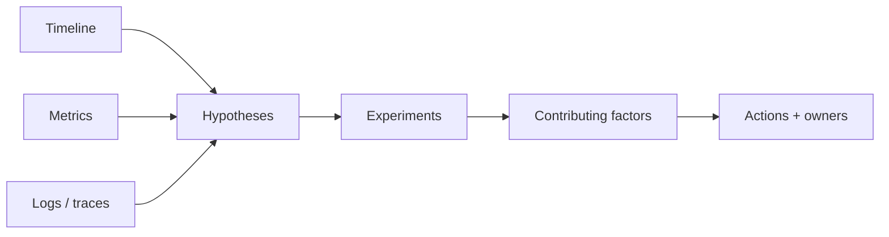

# Incident Packet và Postmortem

Incident packet là bộ evidence tối thiểu giúp đội điều tra có cùng timeline và ngôn ngữ. Postmortem tập trung vào điều kiện hệ thống, không quy lỗi cá nhân.

## Packet structure

Repository cung cấp template tại `incident-packets/templates/` và một sample payment ambiguous outcome.

## Nội dung bắt buộc

- Impact và customer-visible symptom.
- UTC timeline, correlation ID và deploy marker.
- SLO/burn-rate, queue lag, dependency health.
- Hypothesis kèm evidence ủng hộ/phản bác.
- Detection, containment, recovery và verification.
- Action item thuộc prevention, detection, mitigation hoặc learning.

## Quality bar

Action “nhắc developer cẩn thận” không đạt. Action phải thay đổi guardrail, test, telemetry, runbook hoặc architecture. Mỗi action có owner, deadline và verification query.

## Từ packet đến postmortem

Packet thu thập evidence trong incident; postmortem tổng hợp learning sau khi hệ thống ổn định. Không sửa timeline để phù hợp root-cause story. Giữ cả hypothesis sai vì chúng cho thấy observability hoặc mental model nào gây mất thời gian. Phân biệt trigger trực tiếp với latent condition như retry không idempotent, alert thiếu correlation hoặc runbook không có verification query.

## Timeline chất lượng

Mỗi dòng timeline nên có timestamp UTC, nguồn và actor/system. Deploy marker, config change, queue lag và external status cần nằm cùng trục thời gian. Khi clock giữa hệ thống lệch, ghi uncertainty. Không dùng “sau đó” nếu có thể lấy timestamp từ log/trace.

## Action hierarchy

Prevention giảm xác suất lỗi; detection giảm thời gian phát hiện; mitigation giảm impact; recovery giảm thời gian khôi phục; learning cải thiện mental model. Một incident nên có action cân bằng, không chỉ thêm monitor. Ưu tiên guardrail tự động và test failure path.

## Review và follow-up

Postmortem review kiểm tra action có owner, deadline và cách verify. Sau deadline, chạy query/test chứng minh action hoạt động. Nếu incident lặp lại, đánh giá action trước có xử lý symptom thay vì contributing factor không. Liên kết postmortem vào evidence graph để ADR và runbook được cập nhật.
