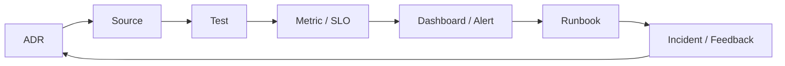

# Design Evidence Graph

Evidence graph liên kết quyết định kiến trúc với implementation và vận hành. Mục tiêu là trả lời: vì sao tồn tại abstraction này, nó được kiểm chứng ở đâu và khi nào cần xem xét lại?

## Node metadata

- Stable ID.
- Owner.
- Repository path hoặc dashboard identifier.
- Last verified date.
- Status: proposed, active, deprecated.

## Edge semantics

- `implements`
- `verified-by`
- `observed-by`
- `operated-with`
- `revisited-because`

Một graph tốt phát hiện orphan abstraction: source không có ADR/test, hoặc ADR không có metric/runbook. `evidence-graph/example.json` minh họa schema nhỏ có thể kiểm tra bằng script.

## Review practice

Trong architecture review, chọn một capability và đi trọn graph. Nếu đội không thể chỉ ra metric hoặc rollback, quyết định chưa đủ operable. Nếu source không còn dùng nhưng ADR vẫn active, cần retirement review.

## Xây graph theo capability

Không tạo graph toàn công ty ngay. Chọn capability critical như payment idempotency, liệt kê ADR, source entrypoint, contract test, metric, dashboard, alert và runbook. Gán ID ổn định và owner. Edge phải có nghĩa rõ; link chung chung “related” ít giá trị hơn `implements` hoặc `verified-by`.

## Kiểm tra graph

Một source node không có `verified-by` là khoảng trống test. ADR active không có source có thể là quyết định chưa triển khai hoặc đã lỗi thời. Alert không có runbook làm tăng thời gian phục hồi. Runbook không liên kết metric/trace dễ trở thành tài liệu không kiểm chứng. Script CI có thể validate path tồn tại và required edge theo loại node.

## Lifecycle

Khi refactor, cập nhật edge trong cùng PR. Khi deprecate abstraction, chuyển status và ghi replacement. Incident có thể thêm `revisited-because` về ADR. Review định kỳ tìm orphan node, stale `lastVerifiedAt` và owner không còn tồn tại.

## Bảo mật và quyền truy cập

Graph có thể chứa dashboard hoặc incident nhạy cảm; lưu identifier thay vì credential/URL private nếu repo public. Tách public learning graph và internal evidence graph. Redact customer data trong sample. Mục tiêu là traceability, không sao chép toàn bộ operational data vào Git.
